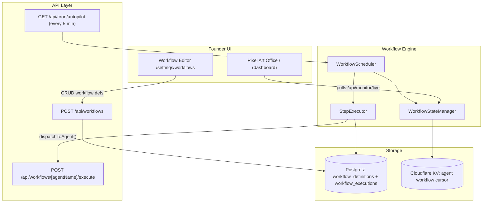
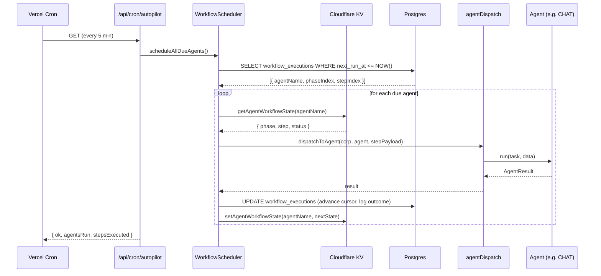
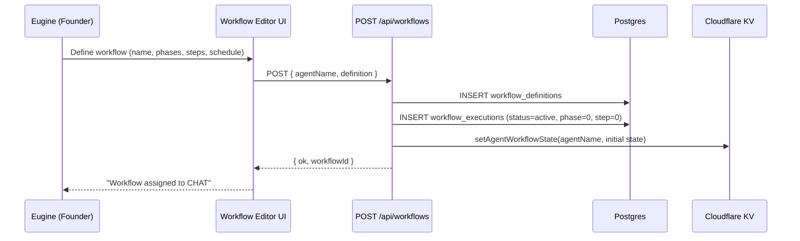

# Design Document: Agent Workflow Engine

## Overview

ProPost Empire's 47 agents are all idle — they resume and immediately go idle because there is no structured workflow driving them. The `work` route runs a flat one-shot function per agent with no phases, no persistence of progress, and no way for Eugine to inject custom workflows. This feature solves that by introducing two things: (1) a **Workflow Engine** that gives every agent a multi-phase, autonomously-executing workflow stored in the database, and (2) a **Pixel Art Virtual Office UI** that replaces the current canvas with proper pixel-art rooms per company, making the office feel alive.

The engine stores workflow definitions (phases → steps → actions) in Postgres, tracks per-agent execution state in Cloudflare KV, and exposes a founder-facing UI where Eugine can create, edit, and assign custom workflows to any agent. The pixel office renders each of the 9 companies as a distinct pixel-art room with animated agents that visually reflect their real execution state.

## Architecture



## Sequence Diagrams

### Autopilot Tick — Agent Executes a Workflow Step



### Founder Creates a Custom Workflow



## Components and Interfaces

### WorkflowEngine (`lib/workflowEngine.ts`)

**Purpose**: Core engine that loads workflow definitions, determines which agents are due to run, executes the next step, and advances the cursor.

**Interface**:

```typescript
interface WorkflowStep {
  id: string;
  name: string;
  action: string; // maps to a dispatchToAgent task string
  params?: Record<string, unknown>;
  durationEstimateMs?: number;
  retryOnError?: boolean;
}

interface WorkflowPhase {
  id: string;
  name: string;
  steps: WorkflowStep[];
  repeatIntervalMs?: number; // null = run once, number = recurring
  runAfterPhaseId?: string; // dependency chain
}

interface WorkflowDefinition {
  id: string;
  agentName: string;
  corp: string;
  name: string;
  description?: string;
  phases: WorkflowPhase[];
  isActive: boolean;
  createdBy: "system" | "founder";
  createdAt: string;
}

interface WorkflowExecutionState {
  workflowId: string;
  agentName: string;
  currentPhaseIndex: number;
  currentStepIndex: number;
  status: "active" | "paused" | "completed" | "error";
  lastRunAt: string;
  nextRunAt: string;
  errorCount: number;
  lastError?: string;
}

interface WorkflowEngine {
  getDueExecutions(): Promise<WorkflowExecutionState[]>;
  executeStep(agentName: string): Promise<StepResult>;
  advanceCursor(agentName: string, result: StepResult): Promise<void>;
  assignWorkflow(
    agentName: string,
    definition: WorkflowDefinition,
  ): Promise<string>;
  getExecutionState(agentName: string): Promise<WorkflowExecutionState | null>;
}
```

**Responsibilities**:

- Determine which agents have a step due based on `next_run_at`
- Execute steps by calling `dispatchToAgent()` with the step's action + params
- Advance the phase/step cursor after each execution
- Handle phase transitions including recurring phases via `repeatIntervalMs`
- Write execution outcomes to `workflow_executions` table

### WorkflowStateManager (`lib/workflowState.ts`)

**Purpose**: Thin KV wrapper that stores the live execution cursor for each agent for fast reads by the UI.

**Interface**:

```typescript
interface AgentWorkflowKV {
  workflowId: string;
  workflowName: string;
  currentPhase: string;
  currentStep: string;
  status: "active" | "paused" | "completed" | "error";
  lastRunAt: string;
  nextRunAt: string;
  progress: number; // 0–100
}

function getAgentWorkflowState(
  agentName: string,
): Promise<AgentWorkflowKV | null>;
function setAgentWorkflowState(
  agentName: string,
  state: AgentWorkflowKV,
): Promise<void>;
```

### Workflow API Routes

- `POST /api/workflows` — Create/update a workflow definition and assign it to an agent
- `GET /api/workflows` — List all workflow definitions for the editor UI
- `GET /api/workflows/[agentName]` — Get workflow + execution state for a specific agent
- `POST /api/workflows/[agentName]/execute` — Manually trigger the next step
- `DELETE /api/workflows/[agentName]` — Deactivate a workflow

### Workflow Editor UI (`app/settings/workflows/page.tsx`)

**Purpose**: Founder-facing page where Eugine can create, edit, and assign workflows to any agent.

**Responsibilities**:

- Agent selector (dropdown of all 47 agents, grouped by corp)
- Phase builder: add/remove/reorder phases, set `repeatIntervalMs`
- Step builder per phase: action string, params JSON, retry toggle
- "Assign to Agent" button
- Live preview of current execution state per agent

### 3D Retro Office (`components/Office3D/`)

**Purpose**: Replace `OfficeCanvas.tsx` with a Claw3D-inspired 3D retro office where each of the 9 companies has its own themed room, agents are 3D characters that animate based on real execution state. Inspired by https://github.com/iamlukethedev/Claw3D — a live retro-office environment where agents appear as workers moving through a shared 3D world with desks, rooms, navigation, and event-driven activity cues.

**Rendering approach**: Three.js (or React Three Fiber) for the 3D scene. Each room is a box-geometry space with low-poly retro furniture (desks, chairs, monitors, whiteboards). Agents are low-poly humanoid meshes that walk between desks, sit, type, and react to workflow events. The camera can orbit the full office or zoom into individual rooms.

**Interface**:

```typescript
interface Office3DRoom {
  corp: Corp;
  label: string;
  theme:
    | "war_room" // XForce — dark, tactical, screens everywhere
    | "boardroom" // LinkedElite — glass table, suits, projector
    | "studio" // GramGod — ring lights, camera rigs, mood lighting
    | "server_room" // WebBoss — racks, blinking LEDs, cold blue light
    | "command_center" // IntelCore — SOVEREIGN's HQ, multiple monitors
    | "people_hub" // HRForce — open plan, bean bags, whiteboards
    | "compliance" // LegalShield — filing cabinets, law books, formal
    | "finance_floor" // FinanceDesk — trading screens, calculators, charts
    | "community_hall"; // PagePower — casual, community boards, warm tones
  agents: Office3DAgent[];
  position: { x: number; z: number }; // 3D grid position
  isActive: boolean; // pulses/glows when agents are working
}

interface Office3DAgent {
  name: string;
  position: { x: number; y: number; z: number };
  rotation: number;
  animationState:
    | "idle"
    | "walking"
    | "typing"
    | "celebrating"
    | "error"
    | "sleeping";
  workflowStep?: string; // shown as floating text / speech bubble above head
  deskAssignment: { x: number; z: number };
  color: string; // unique agent color for identification
}
```

**Responsibilities**:

- Render 9 distinct 3D rooms arranged in a navigable office floor plan
- Each room has low-poly retro furniture matching the company theme (desks, chairs, monitors, props)
- Agents are 3D humanoid characters that animate based on real `WorkflowExecutionState` — not random timers
- Agents walk to their desk when a step starts, type/work while executing, stand up when done
- Floating speech bubbles / name tags above each agent show their current workflow step name
- Click on an agent opens a side panel with their full workflow execution state
- Rooms glow or pulse when agents are actively executing steps
- Camera: default isometric overview of the full office; click a room to zoom in; click an agent to focus
- Event-driven activity cues: when a step completes, agent does a brief celebration animation; on error, agent puts head in hands
- Idle agents wander between the coffee machine, whiteboard, and their desk — driven by `agentIdle.ts` patterns

## Data Models

### `workflow_definitions` (new Postgres table)

```typescript
const workflowDefinitions = pgTable("workflow_definitions", {
  id: uuid("id").primaryKey().defaultRandom(),
  agentName: text("agent_name").notNull(),
  corp: text("corp").notNull(),
  name: text("name").notNull(),
  description: text("description"),
  definition: jsonb("definition").notNull(), // WorkflowDefinition JSON
  isActive: boolean("is_active").default(true),
  createdBy: text("created_by").default("system"),
  createdAt: timestamp("created_at").default(sql`NOW()`),
  updatedAt: timestamp("updated_at").default(sql`NOW()`),
});
```

### `workflow_executions` (new Postgres table)

```typescript
const workflowExecutions = pgTable("workflow_executions", {
  id: uuid("id").primaryKey().defaultRandom(),
  workflowId: uuid("workflow_id").references(() => workflowDefinitions.id),
  agentName: text("agent_name").notNull().unique(), // one active execution per agent
  currentPhaseIndex: integer("current_phase_index").default(0),
  currentStepIndex: integer("current_step_index").default(0),
  status: text("status").default("active"),
  lastRunAt: timestamp("last_run_at"),
  nextRunAt: timestamp("next_run_at").notNull(),
  errorCount: integer("error_count").default(0),
  lastError: text("last_error"),
  completedPhases: jsonb("completed_phases").default("[]"),
  createdAt: timestamp("created_at").default(sql`NOW()`),
  updatedAt: timestamp("updated_at").default(sql`NOW()`),
});
```

**Validation Rules**:

- `agentName` must be in `ALL_AGENT_NAMES`
- `currentPhaseIndex` must be < `definition.phases.length`
- `nextRunAt` must be set on every update (never null after first run)
- Only one `status='active'` execution per agent at a time

## Algorithmic Pseudocode

### Main Autopilot Tick — Workflow Scheduler

```pascal
ALGORITHM scheduleAllDueAgents()
INPUT: none (reads from DB)
OUTPUT: { agentsRun: number, stepsExecuted: number }

BEGIN
  now <- current timestamp

  dueExecutions <- DB.SELECT FROM workflow_executions
    WHERE status = 'active'
    AND next_run_at <= now
    AND agent NOT paused in KV

  ASSERT dueExecutions is a valid list

  results <- []

  FOR each execution IN dueExecutions DO
    ASSERT execution.agentName is valid
    ASSERT execution.currentPhaseIndex >= 0

    TRY
      result <- executeStep(execution.agentName)
      advanceCursor(execution.agentName, result)
      results.add({ agent: execution.agentName, ok: true })
    CATCH error
      handleStepError(execution.agentName, error)
      results.add({ agent: execution.agentName, ok: false, error })
    END TRY
  END FOR

  ASSERT all results have been logged to agent_actions

  RETURN { agentsRun: dueExecutions.length, stepsExecuted: results.filter(ok).length }
END
```

**Preconditions**: DB connection available, `workflow_executions` table migrated, `AGENT_CORP_LOOKUP` populated.

**Postconditions**: All due agents processed, no agent left in `status='active'` in KV, `agent_actions` has a row for every step attempted.

**Loop Invariants**: Agents with `errorCount >= 3` are skipped and set to `status='error'`. Each agent processed at most once per tick.

### Cursor Advancement Algorithm

```pascal
ALGORITHM advanceCursor(agentName, stepResult)
INPUT: agentName: string, stepResult: StepResult
OUTPUT: void

BEGIN
  execution <- DB.SELECT FROM workflow_executions WHERE agent_name = agentName
  definition <- DB.SELECT FROM workflow_definitions WHERE id = execution.workflowId

  phase <- definition.phases[execution.currentPhaseIndex]
  isLastStep <- execution.currentStepIndex >= phase.steps.length - 1
  isLastPhase <- execution.currentPhaseIndex >= definition.phases.length - 1

  IF isLastStep THEN
    IF isLastPhase THEN
      IF phase.repeatIntervalMs IS NOT NULL THEN
        nextPhaseIndex <- execution.currentPhaseIndex
        nextStepIndex <- 0
        nextRunAt <- now + phase.repeatIntervalMs
      ELSE
        DB.UPDATE workflow_executions SET status = 'completed'
        RETURN
      END IF
    ELSE
      nextPhaseIndex <- execution.currentPhaseIndex + 1
      nextStepIndex <- 0
      nextRunAt <- now + (definition.phases[nextPhaseIndex].repeatIntervalMs ?? 0)
    END IF
  ELSE
    nextPhaseIndex <- execution.currentPhaseIndex
    nextStepIndex <- execution.currentStepIndex + 1
    nextRunAt <- now + (step.durationEstimateMs ?? 60000)
  END IF

  DB.UPDATE workflow_executions SET
    currentPhaseIndex = nextPhaseIndex,
    currentStepIndex = nextStepIndex,
    nextRunAt = nextRunAt,
    lastRunAt = now

  setAgentWorkflowState(agentName, {
    currentPhase: definition.phases[nextPhaseIndex].name,
    currentStep: definition.phases[nextPhaseIndex].steps[nextStepIndex].name,
    nextRunAt,
    progress: computeProgress(definition, nextPhaseIndex, nextStepIndex)
  })
END
```

## Key Functions with Formal Specifications

### `scheduleAllDueAgents()`

**Preconditions**: DB connection available. `workflow_executions` table exists. `AGENT_CORP_LOOKUP` populated.

**Postconditions**: All agents with `next_run_at <= now` processed. No agent left in KV `status='active'`. `agent_actions` has a new row for every step attempted.

**Loop Invariants**: `errorCount` is monotonically non-decreasing. Each agent processed at most once per tick.

### `assignWorkflow(agentName, definition)`

**Preconditions**: `agentName` in `ALL_AGENT_NAMES`. `definition.phases.length >= 1`. Each phase has `steps.length >= 1`.

**Postconditions**: Row in `workflow_definitions`. Row in `workflow_executions` with `status='active'`, `currentPhaseIndex=0`, `currentStepIndex=0`. KV updated with initial state. Any previous active execution deactivated.

### `executeStep(agentName)`

**Preconditions**: Agent not paused. `execution.status === 'active'`. Phase and step at current cursor indices exist.

**Postconditions**: Agent was set to `active` then back to `idle` in KV. `agent_actions` has a new row. Returns `StepResult` with `ok: boolean` and `preview: string`.

## Example Usage

### System-Defined Workflow: CHAT (Instagram DM Agent — the "Vy" workflow)

```typescript
const chatWorkflow: WorkflowDefinition = {
  agentName: "chat",
  corp: "gramgod",
  name: "Instagram DM Workflow",
  createdBy: "system",
  phases: [
    {
      id: "phase-backlog",
      name: "PHASE 1: BACKLOG CLEARANCE",
      repeatIntervalMs: null,
      steps: [
        {
          id: "s1",
          name: "Scan 21 days of DMs",
          action: "scan_dm_backlog",
          params: { days: 21 },
        },
        {
          id: "s2",
          name: "Classify by tier",
          action: "classify_messages",
          params: { tiers: ["brand", "meaningful", "praise", "greeting"] },
        },
        {
          id: "s3",
          name: "Reply Tier 1 Brand/Collab",
          action: "reply_dm_batch",
          params: { tier: "brand", language: "english" },
        },
        {
          id: "s4",
          name: "Reply Tier 2 Meaningful",
          action: "reply_dm_batch",
          params: { tier: "meaningful", language: "sheng_english" },
        },
        {
          id: "s5",
          name: "Reply Tier 3+4 Quick",
          action: "reply_dm_batch",
          params: { tier: "quick", language: "sheng" },
        },
      ],
    },
    {
      id: "phase-shoutout",
      name: "PHASE 2: SHOUTOUT SELECTION",
      repeatIntervalMs: null,
      steps: [
        {
          id: "s6",
          name: "Score messages 0-10",
          action: "score_messages",
          params: { criteria: ["authenticity", "engagement", "story"] },
        },
        {
          id: "s7",
          name: "Pick top 10 for TV shoutouts",
          action: "select_shoutouts",
          params: { count: 10 },
        },
      ],
    },
    {
      id: "phase-report",
      name: "PHASE 3: REPORTING",
      repeatIntervalMs: null,
      steps: [
        {
          id: "s8",
          name: "Send Gmail report",
          action: "send_gmail_report",
          params: { to: "eugine@propost.com", includeShoutouts: true },
        },
      ],
    },
    {
      id: "phase-ongoing",
      name: "PHASE 4: ONGOING ENGAGEMENT",
      repeatIntervalMs: 24 * 60 * 60 * 1000,
      steps: [
        {
          id: "s9",
          name: "Daily 30-interaction routine",
          action: "daily_engagement",
          params: { interactions: 30, maxResponseTimeHrs: 24 },
        },
      ],
    },
  ],
  isActive: true,
};
```

### Founder Creates a Custom Workflow via UI

```typescript
// Eugine types this in the Workflow Editor and clicks "Assign"
const customWorkflow: WorkflowDefinition = {
  agentName: "blaze",
  corp: "xforce",
  name: "Viral X Campaign — Nairobi Tech Week",
  createdBy: "founder",
  phases: [
    {
      id: "p1",
      name: "Pre-Event Hype",
      repeatIntervalMs: 6 * 60 * 60 * 1000, // every 6 hours
      steps: [
        {
          id: "s1",
          name: "Write hot take about tech week",
          action: "generate_hot_take",
          params: { topic: "Nairobi Tech Week", tone: "hype" },
        },
        {
          id: "s2",
          name: "Post to X",
          action: "post_to_platform",
          params: { platform: "x" },
        },
      ],
    },
  ],
  isActive: true,
};

// POST /api/workflows
const response = await fetch("/api/workflows", {
  method: "POST",
  body: JSON.stringify({ agentName: "blaze", definition: customWorkflow }),
});
// -> { ok: true, workflowId: 'uuid...' }
```

## Error Handling

### Error Scenario 1: Step Execution Fails

**Condition**: `dispatchToAgent()` throws or returns an error result.

**Response**: Increment `errorCount`. Log to `agent_actions` with `outcome='error'`. Set `next_run_at = now + 5 minutes` (retry backoff).

**Recovery**: After 3 consecutive errors, set `status='error'` and emit a `crisis_alert` action so it appears in the activity feed. Eugine resets via the Workflow Editor.

### Error Scenario 2: Agent is Paused

**Condition**: `isAgentPaused(agentName)` returns `true` when the scheduler tries to run it.

**Response**: Skip the agent entirely this tick. Do not advance the cursor. Do not log an error.

**Recovery**: When `resumeAgent()` is called, the scheduler picks it up on the next tick automatically since `next_run_at` is still in the past.

### Error Scenario 3: Workflow Definition Deleted Mid-Execution

**Condition**: `workflow_executions` references a `workflow_id` that no longer exists.

**Response**: Set execution `status='error'`, log `workflow_definition_missing` to `agent_actions`.

**Recovery**: Eugine assigns a new workflow via the editor.

### Error Scenario 4: Phase Dependency Not Met

**Condition**: A phase has `runAfterPhaseId` pointing to a phase that hasn't completed yet.

**Response**: Skip this phase's steps. Set `next_run_at = now + 1 minute` to re-check.

**Recovery**: Automatic — once the dependency phase completes, the cursor advances normally.

## Testing Strategy

### Unit Testing Approach

Test cursor advancement logic in isolation with mock DB/KV:

- `advanceCursor` correctly moves to next step within a phase
- `advanceCursor` correctly transitions to next phase when last step completes
- `advanceCursor` correctly loops a recurring phase (sets `nextRunAt = now + repeatIntervalMs`)
- `advanceCursor` correctly marks workflow `completed` when last phase's last step finishes
- `executeStep` skips paused agents
- `executeStep` increments `errorCount` on failure

### Property-Based Testing Approach

**Property Test Library**: fast-check

Key properties:

- For any valid `WorkflowDefinition` with N phases and M steps each, after exactly N×M successful `advanceCursor` calls (non-recurring), `status === 'completed'`
- `progress` returned by `computeProgress` is always in [0, 100]
- A recurring phase never sets `status='completed'` — it always sets a future `nextRunAt`
- `errorCount` is monotonically non-decreasing across any sequence of step executions

### Integration Testing Approach

- POST a workflow definition → verify `workflow_executions` row created with correct initial state
- Trigger autopilot tick → verify `agent_actions` row created and cursor advanced
- Pause an agent → trigger tick → verify agent was skipped (no new `agent_actions` row)
- Assign a new workflow to an agent that already has one → verify old execution deactivated

## Performance Considerations

- The scheduler queries `workflow_executions WHERE next_run_at <= NOW()` — this column must be indexed.
- Autopilot runs every 5 minutes on Vercel Cron. Each tick processes all due agents in parallel via `Promise.allSettled`, capped at 10 concurrent dispatches to avoid Gemini rate limits.
- KV reads/writes are O(1) per agent. The status page and pixel office both read from KV, not DB, for agent state.
- Workflow definitions are cached in memory for the duration of a single autopilot tick and re-fetched each tick to pick up founder edits.

## Security Considerations

- The Workflow Editor (`/settings/workflows`) is behind `getServerSession` — only Eugine can access it.
- `POST /api/workflows` validates that `agentName` is in `ALL_AGENT_NAMES` to prevent injection of arbitrary agent names.
- Step `action` strings are validated against an allowlist of known action types before dispatch.
- Workflow `params` are passed as structured JSON, never interpolated into shell commands or SQL.
- The `createdBy: 'founder'` flag is set server-side, not trusted from the client payload.

## Dependencies

- **Existing**: `drizzle-orm`, `@google/generative-ai`, Cloudflare KV, `lib/agentDispatch`, `lib/agentState`, `lib/schema`
- **New DB tables**: `workflow_definitions`, `workflow_executions` (Drizzle migration required)
- **New lib files**: `lib/workflowEngine.ts`, `lib/workflowState.ts`, `lib/defaultWorkflows.ts`
- **New API routes**: `/api/workflows`, `/api/workflows/[agentName]`, `/api/workflows/[agentName]/execute`
- **New UI pages**: `app/settings/workflows/page.tsx`
- **New UI components**: `components/Office3D/` (replaces `components/OfficeCanvas.tsx`) — Three.js/React Three Fiber 3D retro office inspired by Claw3D (https://github.com/iamlukethedev/Claw3D), with 9 themed rooms, low-poly agent characters, desk assignments, walk/type/celebrate animations, and event-driven activity cues

## Correctness Properties

_A property is a characteristic or behavior that should hold true across all valid executions of a system — essentially, a formal statement about what the system should do. Properties serve as the bridge between human-readable specifications and machine-verifiable correctness guarantees._

### Property 1: Workflow Assignment Initial State

_For any_ valid agent name and workflow definition, after `assignWorkflow(agentName, definition)` completes, the resulting `workflow_executions` row must have `status='active'`, `currentPhaseIndex=0`, `currentStepIndex=0`, and `nextRunAt` set to a non-null timestamp.

**Validates: Requirements 1.3**

### Property 2: Single Active Execution Per Agent

_For any_ sequence of workflow assignments to the same agent, at most one `workflow_executions` row with `status='active'` exists for that agent at any point in time.

**Validates: Requirements 1.4**

### Property 3: Cursor Advances on Success

_For any_ agent with an active execution at `(phaseIndex, stepIndex)` where `stepIndex < phase.steps.length - 1`, after a successful `executeStep`, the execution row must have `currentStepIndex = stepIndex + 1` and `currentPhaseIndex` unchanged.

**Validates: Requirements 3.1**

### Property 4: Phase Transition on Last Step

_For any_ agent at the last step of a non-last phase, after a successful `executeStep`, the execution row must have `currentPhaseIndex` incremented by 1 and `currentStepIndex = 0`.

**Validates: Requirements 3.2**

### Property 5: Workflow Completion

_For any_ valid `WorkflowDefinition` with N non-recurring phases and M steps each, after exactly N×M successful `advanceCursor` calls, the execution `status` must equal `'completed'`.

**Validates: Requirements 3.3**

### Property 6: Recurring Phase Never Completes

_For any_ recurring phase (has `repeatIntervalMs`), no matter how many times its last step completes, the execution `status` must never be set to `'completed'` — it must always remain `'active'` with a future `nextRunAt`.

**Validates: Requirements 3.4**

### Property 7: Progress Range Invariant

_For any_ valid `WorkflowDefinition` and any `(currentPhaseIndex, currentStepIndex)` within bounds, `computeProgress(definition, phaseIndex, stepIndex)` must return an integer value in the closed interval [0, 100].

**Validates: Requirements 3.6**

### Property 8: KV Consistency After Cursor Advance

_For any_ successful `advanceCursor` call, the Cloudflare KV entry for that agent must be updated to reflect the new `currentPhase`, `currentStep`, `status`, and `nextRunAt` values that were written to Postgres.

**Validates: Requirements 4.1, 4.2**

### Property 9: Paused Agent Skip Invariant

_For any_ agent with `isPaused=true` in KV, after a Scheduler tick, the agent's `currentPhaseIndex`, `currentStepIndex`, and `nextRunAt` in `workflow_executions` must be unchanged, and no new `agent_actions` row must be created for that agent during that tick.

**Validates: Requirements 2.5, 9.4**

### Property 10: Error Count Monotonicity

_For any_ sequence of step executions for a given agent, `error_count` in `workflow_executions` is monotonically non-decreasing — it never decreases between ticks.

**Validates: Requirements 2.6**

### Property 11: Agent Name Validation

_For any_ `POST /api/workflows` request where `agentName` is not present in `ALL_AGENT_NAMES`, the Workflow_API must return a 4xx error response and must not insert any row into `workflow_definitions` or `workflow_executions`.

**Validates: Requirements 6.2, 10.3**

### Property 12: Seed Idempotency

_For any_ agent that already has a `status='active'` execution, running the Seed_Function must not create a new `workflow_executions` row for that agent — the existing row must remain unchanged.

**Validates: Requirements 7.2**

### Property 13: Pixel Agent State Reflects Workflow State

_For any_ set of agent workflow states provided to the Pixel_Office component, each rendered Pixel_Agent's animation state must match the corresponding workflow execution status: `'active'` → `'working'`, `'idle'`/`'completed'` → `'idle'`, `'error'` → `'error'`.

**Validates: Requirements 8.3, 8.4, 8.5**

### Property 14: Speech Bubble Content

_For any_ agent in the `'working'` state with a non-empty `currentStep` name, the Pixel_Office must render a speech bubble element containing that step name as its text content.

**Validates: Requirements 8.6**

### Property 15: Audit Log Completeness

_For any_ step execution attempt (success or failure), exactly one `agent_actions` row must be inserted with the correct `agentName`, `company`, `actionType`, and `outcome` fields.

**Validates: Requirements 2.3, 9.1, 9.2, 9.3**
