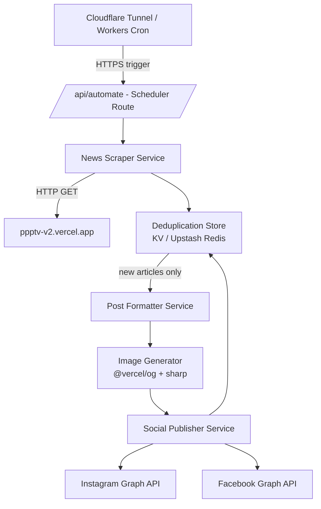
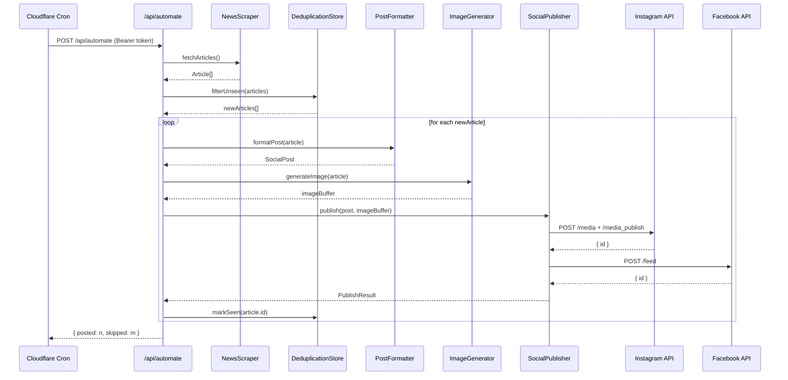
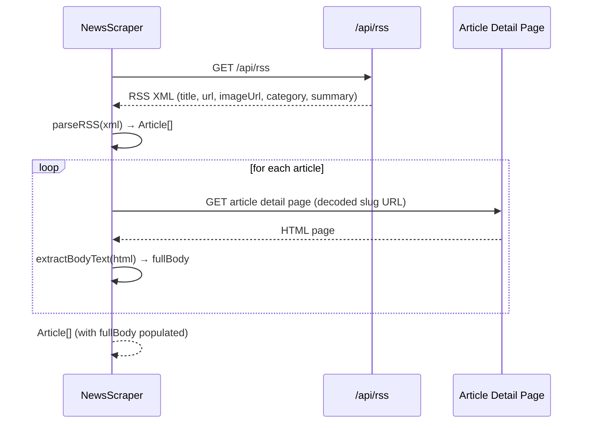

# Design Document: news-auto-poster

## Overview

The `news-auto-poster` feature automatically scrapes news articles from `https://ppptv-v2.vercel.app/`, generates formatted social media posts, and publishes them to Instagram and Facebook on a schedule. It runs as a set of Next.js API routes backed by a Cloudflare Tunnel (or Cloudflare Workers cron trigger) to ensure secure, reliable execution without exposing the origin server directly.

The system is designed to be idempotent — each article is tracked by a unique identifier so it is never posted twice. The scheduling layer polls the source site at a configurable interval, compares against a seen-articles store, and dispatches new content through the social media publishing pipeline.

The feature integrates natively into the existing `auto-news-station` Next.js 14 project, adding new API routes (`/api/news`, `/api/automate`) and a lightweight persistence layer for deduplication.

---

## Architecture



---

## Sequence Diagrams

### Main Automation Flow



### Scraping Flow



---

## Components and Interfaces

### Component 1: NewsScraper

**Purpose**: Fetches articles from the RSS feed, then scrapes each article's detail page for the full body text.

**Interface**:

```typescript
interface NewsScraper {
  fetchArticles(): Promise<Article[]>;
}
```

**Responsibilities**:

- Fetch `https://ppptv-v2.vercel.app/api/rss` using `rss-parser`
- Parse each RSS item: title, link (base64-encoded slug → decoded article URL), `media:content` or `enclosure` for `imageUrl`, category, summary, `pubDate`
- For each RSS item, HTTP GET the article detail page and use `cheerio` to extract all body paragraph text as `fullBody`
- Return a normalized `Article[]` array with `fullBody` populated

---

### Component 2: DeduplicationStore

**Purpose**: Tracks which article IDs have already been posted to prevent duplicate posts.

**Interface**:

```typescript
interface DeduplicationStore {
  filterUnseen(articles: Article[]): Promise<Article[]>;
  markSeen(articleId: string): Promise<void>;
  hasSeen(articleId: string): Promise<boolean>;
}
```

**Responsibilities**:

- Backed by Upstash Redis (KV) via REST API — works in both Edge and Node runtimes
- Uses article URL hash or slug as the stable key
- TTL-based expiry optional (e.g., 30 days) to avoid unbounded growth

---

### Component 3: PostFormatter

**Purpose**: Transforms a raw `Article` into platform-specific caption text.

**Interface**:

```typescript
interface PostFormatter {
  formatPost(article: Article, platform: Platform): SocialPost;
}
```

**Responsibilities**:

- Use `article.fullBody` as the base caption text
- Append source attribution: `"📰 Source: [sourceName]"`
- Append article URL
- Append hashtags derived from `article.category` (e.g. `#Celebrity`, `#TVAndFilm`) plus general tags (`#PPPTVKenya #Entertainment`)
- Truncate to platform limits: Instagram 2200 chars, Facebook 63,206 chars (truncation applied after hashtags are appended, preserving attribution)

---

### Component 4: ImageGenerator

**Purpose**: Generates a branded 1080×1080 JPEG image card in the RAP TV style using `satori` + `sharp`.

**Interface**:

```typescript
interface ImageGenerator {
  generateImage(article: Article): Promise<Buffer>;
}
```

**Responsibilities**:

Compose the following layers in order (back to front):

1. **Background** — Article `imageUrl` fetched and rendered as a cover-fit fill for the full 1080×1080 canvas. If unavailable, use a solid dark fallback color.
2. **Gradient overlay** — A vertical linear gradient rectangle spanning the full canvas: top is fully transparent (`rgba(0,0,0,0)`), bottom is near-opaque dark (`rgba(0,0,0,0.85)`). This creates the "stage" for text legibility.
3. **PPP TV logo** — Small branded logo image positioned in the top-right corner (or top-left), white/branded variant, ~120px wide.
4. **Category tag** — Small all-caps label (e.g. `"TV & FILM"`, `"CELEBRITY"`) rendered just above the headline in the brand accent color (PPP TV red or yellow). Font size ~28–32px, letter-spaced.
5. **Headline text** — Large, bold, ALL CAPS text in the lower portion of the image (above the gradient's darkest band). Two-tone coloring:
   - Most words rendered in white
   - 1–3 "highlight words" (the most newsworthy noun/phrase extracted from the headline) rendered in the brand accent color
   - Highlight word selection: pick the most impactful proper noun or subject phrase (e.g. a celebrity name, show title, or key action word)
   - Font size ~64–80px, line-height tight, max 2–3 lines

Use `satori` for JSX-to-SVG layout of all text and overlay layers, `sharp` to composite the background image and convert the final SVG to a 1080×1080 JPEG. Return raw `Buffer`.

---

### Component 5: SocialPublisher

**Purpose**: Uploads media and publishes posts to Instagram and Facebook via their Graph APIs.

**Interface**:

```typescript
interface SocialPublisher {
  publish(post: SocialPost, imageBuffer: Buffer): Promise<PublishResult>;
}
```

**Responsibilities**:

- Instagram: two-step publish (create container → publish container)
- Facebook: single `POST /feed` with `source` multipart or hosted image URL
- Retry with exponential backoff on transient 5xx errors
- Return per-platform result (success/failure + platform post ID)

---

### Component 6: Scheduler / API Route

**Purpose**: Entry point triggered by Cloudflare on a cron schedule.

**Interface**:

```typescript
// Next.js Route Handler
POST / api / automate;
Authorization: Bearer<AUTOMATE_SECRET>;
```

**Responsibilities**:

- Validate bearer token to prevent unauthorized triggers
- Orchestrate the full pipeline: scrape → deduplicate → format → generate image → publish
- Return a JSON summary `{ posted, skipped, errors }`

---

## Data Models

### Article

```typescript
interface Article {
  id: string; // stable hash of canonical URL
  title: string;
  url: string; // canonical article URL (decoded from base64 slug)
  imageUrl: string; // thumbnail/hero image URL
  summary: string; // excerpt from RSS item
  fullBody: string; // full body text scraped from article detail page
  sourceName: string; // e.g. "PPP TV", "The Standard"
  publishedAt: Date;
  category: string; // e.g. "CELEBRITY", "TV & FILM", "MUSIC", "EAST AFRICA"
  tags?: string[];
}
```

**Validation Rules**:

- `id` must be non-empty (derived from URL)
- `title` must be non-empty, max 500 chars
- `url` must be a valid absolute URL
- `publishedAt` must be a valid date, not in the future by more than 1 hour
- `category` must be non-empty (fallback to `"GENERAL"` if RSS item has none)

---

### SocialPost

```typescript
interface SocialPost {
  platform: Platform;
  caption: string; // formatted caption with hashtags
  imageUrl?: string; // hosted image URL (if pre-uploaded)
  articleUrl: string; // source article link
}

type Platform = "instagram" | "facebook";
```

---

### PublishResult

```typescript
interface PublishResult {
  instagram: PlatformResult;
  facebook: PlatformResult;
}

interface PlatformResult {
  success: boolean;
  postId?: string;
  error?: string;
}
```

---

### SchedulerResponse

```typescript
interface SchedulerResponse {
  posted: number;
  skipped: number;
  errors: Array<{ articleId: string; message: string }>;
}
```

---

## Algorithmic Pseudocode

### Main Automation Algorithm

```pascal
ALGORITHM runAutomation()
INPUT: none (triggered by HTTP POST)
OUTPUT: SchedulerResponse

BEGIN
  ASSERT request.headers.authorization = "Bearer " + AUTOMATE_SECRET

  articles ← NewsScraper.fetchArticles()
  ASSERT articles IS array

  newArticles ← DeduplicationStore.filterUnseen(articles)

  posted ← 0
  skipped ← articles.length - newArticles.length
  errors ← []

  FOR each article IN newArticles DO
    TRY
      post_ig ← PostFormatter.formatPost(article, 'instagram')
      post_fb ← PostFormatter.formatPost(article, 'facebook')
      imageBuffer ← ImageGenerator.generateImage(article)

      result ← SocialPublisher.publish({ ig: post_ig, fb: post_fb }, imageBuffer)

      IF result.instagram.success AND result.facebook.success THEN
        DeduplicationStore.markSeen(article.id)
        posted ← posted + 1
      ELSE
        errors.append({ articleId: article.id, message: result.error })
      END IF
    CATCH error
      errors.append({ articleId: article.id, message: error.message })
    END TRY
  END FOR

  RETURN { posted, skipped, errors }
END
```

**Preconditions**:

- `AUTOMATE_SECRET` env var is set
- All downstream services (KV, Instagram API, Facebook API) are reachable

**Postconditions**:

- Every article in `newArticles` is either posted + marked seen, or recorded in `errors`
- `posted + skipped + errors.length = articles.length`

**Loop Invariants**:

- `posted + errors.length` equals the number of articles processed so far
- No article is marked seen unless both platforms returned success

---

### Scraping Algorithm

```pascal
ALGORITHM fetchArticles()
INPUT: none
OUTPUT: Article[]

BEGIN
  feed ← RSS_PARSE("https://ppptv-v2.vercel.app/api/rss")
  ASSERT feed.items IS array

  results ← []

  FOR each item IN feed.items DO
    title      ← item.title.trim()
    rawLink    ← item.link  // may be base64-encoded slug
    url        ← decodeArticleUrl(rawLink)
    imageUrl   ← item.enclosure.url OR item["media:content"].url OR ""
    summary    ← item.contentSnippet OR item.summary OR ""
    sourceName ← item.creator OR item.author OR "PPP TV"
    category   ← item.categories[0] OR "GENERAL"
    publishedAt ← parseDate(item.pubDate)

    IF title IS NOT empty AND url IS NOT empty THEN
      // Fetch full body from article detail page
      html     ← HTTP_GET(url)
      dom      ← parseHTML(html.body)
      fullBody ← dom.selectAll("p").map(p => p.text().trim()).join("\n\n")

      id ← sha256(url)
      results.append({ id, title, url, imageUrl, summary, fullBody,
                        sourceName, category, publishedAt })
    END IF
  END FOR

  RETURN results
END
```

**Preconditions**:

- RSS feed URL is reachable
- Each article detail page URL is resolvable (decoded from base64 slug if needed)

**Postconditions**:

- Returns array (may be empty if feed has no items)
- Each article has a stable `id` derived from its URL
- `fullBody` contains concatenated paragraph text from the detail page

---

### Deduplication Algorithm

```pascal
ALGORITHM filterUnseen(articles)
INPUT: articles: Article[]
OUTPUT: Article[]

BEGIN
  unseen ← []

  FOR each article IN articles DO
    seen ← KV.get("seen:" + article.id)
    IF seen IS NULL THEN
      unseen.append(article)
    END IF
  END FOR

  RETURN unseen
END
```

**Loop Invariants**:

- All articles in `unseen` so far have not been seen in KV

---

## Key Functions with Formal Specifications

### `fetchArticles()`

```typescript
async function fetchArticles(): Promise<Article[]>;
```

**Preconditions**:

- Network access to `ppptv-v2.vercel.app` is available
- `rss-parser` is configured with a reasonable timeout (10s)
- `axios` + `cheerio` available for detail page fetching

**Postconditions**:

- Returns `Article[]` (empty array if feed has no items, never throws on empty)
- Each article's `id` is a deterministic hash of its `url`
- Each article's `fullBody` is non-empty if the detail page was reachable (falls back to `summary` on fetch failure)
- Throws `ScraperError` on RSS fetch failure

---

### `generateImage(article)`

```typescript
async function generateImage(article: Article): Promise<Buffer>;
```

**Preconditions**:

- `article.title` is non-empty
- `article.imageUrl` is a valid URL or empty string (fallback to solid dark background)
- `article.category` is non-empty (used for the category tag layer)

**Postconditions**:

- Returns a JPEG `Buffer` of exactly 1080×1080 pixels
- Output contains all five layers in order: background image → gradient overlay → PPP TV logo → category tag → headline text
- Headline text is ALL CAPS; 1–3 highlight words are rendered in accent color, remainder in white
- Never returns an empty buffer
- Throws `ImageGenerationError` on satori/sharp failure

---

### `publish(post, imageBuffer)`

```typescript
async function publish(
  posts: { ig: SocialPost; fb: SocialPost },
  imageBuffer: Buffer,
): Promise<PublishResult>;
```

**Preconditions**:

- `INSTAGRAM_ACCESS_TOKEN`, `INSTAGRAM_ACCOUNT_ID` env vars are set
- `FACEBOOK_ACCESS_TOKEN`, `FACEBOOK_PAGE_ID` env vars are set
- `imageBuffer` is a valid JPEG buffer

**Postconditions**:

- Returns `PublishResult` with per-platform success/failure
- On transient error: retries up to 3 times with exponential backoff
- On permanent error: sets `success: false` with error message, does not throw

---

## Example Usage

```typescript
// POST /api/automate
// Called by Cloudflare Workers cron or tunnel webhook

import { NextRequest, NextResponse } from "next/server";
import { NewsScraper } from "@/lib/scraper";
import { DeduplicationStore } from "@/lib/dedup";
import { PostFormatter } from "@/lib/formatter";
import { ImageGenerator } from "@/lib/image-gen";
import { SocialPublisher } from "@/lib/publisher";

export async function POST(req: NextRequest) {
  const auth = req.headers.get("authorization");
  if (auth !== `Bearer ${process.env.AUTOMATE_SECRET}`) {
    return NextResponse.json({ error: "Unauthorized" }, { status: 401 });
  }

  const scraper = new NewsScraper();
  const dedup = new DeduplicationStore();
  const formatter = new PostFormatter();
  const imgGen = new ImageGenerator();
  const publisher = new SocialPublisher();

  const articles = await scraper.fetchArticles();
  const newArticles = await dedup.filterUnseen(articles);

  let posted = 0;
  const errors: Array<{ articleId: string; message: string }> = [];

  for (const article of newArticles) {
    try {
      const igPost = formatter.formatPost(article, "instagram");
      const fbPost = formatter.formatPost(article, "facebook");
      const image = await imgGen.generateImage(article);
      const result = await publisher.publish({ ig: igPost, fb: fbPost }, image);

      if (result.instagram.success && result.facebook.success) {
        await dedup.markSeen(article.id);
        posted++;
      } else {
        errors.push({ articleId: article.id, message: JSON.stringify(result) });
      }
    } catch (err: any) {
      errors.push({ articleId: article.id, message: err.message });
    }
  }

  return NextResponse.json({
    posted,
    skipped: articles.length - newArticles.length,
    errors,
  });
}
```

---

## Correctness Properties

- For all articles `a` in the source: if `a` was successfully posted in a previous run, `filterUnseen` must exclude it in all subsequent runs.
- For all runs: `posted + skipped + errors.length === articles.length` (no article is silently dropped).
- For all generated images: the output buffer represents a valid JPEG of dimensions 1080×1080.
- For all publish calls: if the API returns a non-retryable error (4xx), the system records the failure and continues without retrying.
- The `/api/automate` endpoint must return HTTP 401 for any request missing or presenting an incorrect bearer token.

---

## Error Handling

### Scenario 1: Source site unreachable

**Condition**: `axios` GET to `ppptv-v2.vercel.app` times out or returns 5xx  
**Response**: Throw `ScraperError`, caught by the orchestrator, entire run aborts with `{ posted: 0, skipped: 0, errors: [{ message: 'Scraper failed: ...' }] }`  
**Recovery**: Cloudflare cron retries on next scheduled interval

---

### Scenario 2: KV store unavailable

**Condition**: Upstash Redis REST call fails  
**Response**: Fail open — treat all articles as unseen (safe to attempt posting; dedup will catch duplicates on next run once KV recovers)  
**Recovery**: Log warning, continue pipeline

---

### Scenario 3: Instagram API rate limit (429)

**Condition**: Instagram Graph API returns 429  
**Response**: Stop publishing for current run, record remaining articles as errors  
**Recovery**: Next cron run will retry (articles not yet marked seen)

---

### Scenario 4: Image generation failure

**Condition**: `satori` or `sharp` throws  
**Response**: Skip image generation, attempt text-only post on Facebook; skip Instagram (requires image)  
**Recovery**: Log error, mark article as partially posted

---

## Testing Strategy

### Unit Testing Approach

Test each service class in isolation with mocked HTTP clients and KV stores.

Key test cases:

- `NewsScraper.fetchArticles()` returns correct `Article[]` from fixture HTML
- `DeduplicationStore.filterUnseen()` correctly excludes seen article IDs
- `PostFormatter.formatPost()` truncates captions to platform limits
- `ImageGenerator.generateImage()` returns a buffer with correct JPEG magic bytes
- `SocialPublisher.publish()` retries on 503 and stops on 429

### Property-Based Testing Approach

**Property Test Library**: `fast-check`

Properties to verify:

- For any `Article[]` input, `filterUnseen(articles).length <= articles.length`
- For any article, `formatPost(article, platform).caption.length <= platformLimit[platform]`
- For any article, `sha256(article.url)` is deterministic and collision-resistant (same URL → same ID)
- For any `PublishResult`, `posted + skipped + errors.length === total` invariant holds

### Integration Testing Approach

- End-to-end test against a local mock server mimicking `ppptv-v2.vercel.app` HTML structure
- Mock Instagram and Facebook Graph API endpoints with `msw` (Mock Service Worker)
- Verify the full pipeline from scrape → dedup → format → image → publish produces correct API calls

---

## Performance Considerations

- Article scraping is a single HTTP request; parse time is O(n) in article count — negligible.
- Image generation with `satori` + `sharp` takes ~200–500ms per image; for batches >10 articles, consider parallelizing with `Promise.all` with a concurrency limit of 3.
- Upstash Redis REST calls add ~50ms per article for dedup checks; batch `MGET` can reduce this to a single round-trip.
- Instagram Graph API has a rate limit of 200 posts per user per day — the scheduler should enforce a daily cap.

---

## Security Considerations

- `/api/automate` is protected by a `AUTOMATE_SECRET` bearer token; Cloudflare Tunnel ensures the origin is not publicly reachable without the token.
- All API credentials (Instagram, Facebook, Upstash) are stored as environment variables, never hardcoded.
- Scraped HTML is never executed — only text content and attribute values are extracted.
- Image URLs from the source are fetched server-side; no user-controlled URLs are passed to `sharp` without validation.
- Cloudflare Tunnel terminates TLS at the edge, preventing MITM between Cloudflare and the Next.js origin.

---

## Dependencies

| Package                     | Purpose                                                    |
| --------------------------- | ---------------------------------------------------------- |
| `rss-parser`                | Parse RSS feed from `/api/rss` (already in package.json)   |
| `axios`                     | HTTP client for article detail page fetching and API calls |
| `cheerio`                   | Server-side HTML parsing for article body extraction (add) |
| `@vercel/og` / `satori`     | JSX-to-SVG rendering for layered image template            |
| `sharp`                     | Background image compositing and JPEG output               |
| `@upstash/redis`            | KV store for deduplication (add)                           |
| `next` 14                   | API routes and server runtime                              |
| Instagram Graph API         | Publishing photos/reels to Instagram                       |
| Facebook Graph API          | Publishing posts to a Facebook Page                        |
| Cloudflare Tunnel / Workers | Secure cron trigger and origin protection                  |
