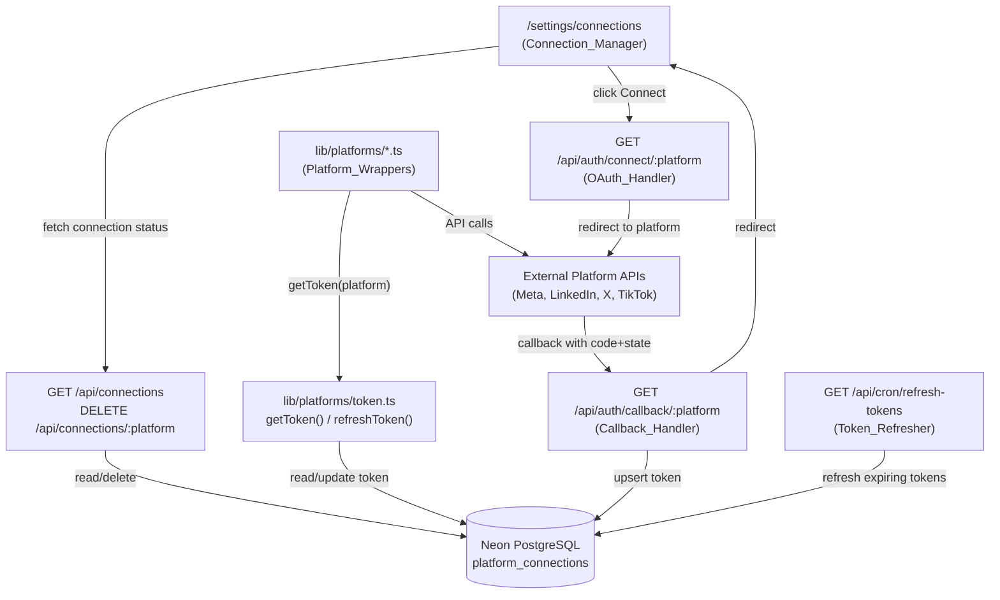

# Design Document: OAuth Platform Connect

## Overview

OAuth Platform Connect replaces hardcoded environment variable tokens in ProPost with a proper OAuth 2.0 "Connect" flow for each social platform. The sole user (Eugine) visits `/settings/connections`, clicks Connect for a platform, is redirected to that platform's authorization page, and is redirected back to ProPost where the token is persisted to Neon PostgreSQL via Drizzle ORM. All platform API wrappers then read tokens from the DB via a shared `getToken()` helper instead of `process.env.*`.

Supported platforms: Instagram, Facebook (both via Meta OAuth), LinkedIn, X/Twitter (OAuth 2.0 PKCE), and TikTok.

The app is a Next.js 14 App Router project deployed on Vercel. NextAuth is already configured for Google login (single-user allowlist). The new OAuth routes are custom Next.js API routes — they do not use NextAuth providers.

---

## Architecture



### Key Design Decisions

**Custom OAuth routes, not NextAuth providers**: The platform connections are for posting/reading on behalf of Eugine's accounts, not for authenticating users into ProPost. NextAuth providers are designed for user authentication. Using custom routes keeps the concerns cleanly separated and avoids fighting NextAuth's session model.

**Single-user, no multi-tenancy**: The `platform_connections` table has a unique constraint on `platform` only (no `user_id`). This is intentional — ProPost is a single-user app.

**PKCE for X/Twitter**: X OAuth 2.0 requires PKCE (Proof Key for Code Exchange). The `code_verifier` is generated server-side, stored in a short-lived HTTP-only cookie alongside the `state`, and sent during token exchange.

**On-demand refresh in `getToken()`**: Rather than relying solely on the cron job, `getToken()` checks if the token expires within 5 minutes and refreshes it inline. This prevents posting failures between cron runs.

**Meta unified token**: Instagram and Facebook share the same Meta OAuth app and access token (a Page token grants access to both the Page and its linked Instagram Business Account). They are stored as separate rows (`platform = 'instagram'` and `platform = 'facebook'`) but the OAuth flow for Instagram also stores the Facebook page token.

---

## Components and Interfaces

### 1. DB Schema — `lib/schema.ts`

New table `platform_connections` added to the existing Drizzle schema file.

### 2. Token Helper — `lib/platforms/token.ts`

```typescript
export async function getToken(platform: string): Promise<string>
export async function refreshToken(platform: string): Promise<string>
```

`getToken` reads from the DB, checks expiry, and calls `refreshToken` if needed. Throws `PlatformNotConnectedError` if no record exists.

### 3. OAuth Handler — `app/api/auth/connect/[platform]/route.ts`

```
GET /api/auth/connect/:platform
```

- Validates session (redirects to `/login` if unauthenticated)
- Validates `platform` is one of the supported values
- Generates `state` (and `code_verifier` for X PKCE)
- Stores state + verifier in HTTP-only cookie (`oauth_state_<platform>`, 10-min expiry)
- Redirects to platform authorization URL

### 4. Callback Handler — `app/api/auth/callback/[platform]/route.ts`

```
GET /api/auth/callback/:platform?code=...&state=...
```

- Validates session
- Reads and validates `state` cookie
- Exchanges `code` for tokens (includes `code_verifier` for X)
- Fetches platform user info (username/handle)
- Upserts record in `platform_connections`
- Redirects to `/settings/connections?connected=<platform>` or `?error=<reason>`

### 5. Connections API — `app/api/connections/route.ts` and `app/api/connections/[platform]/route.ts`

```
GET  /api/connections
DELETE /api/connections/:platform
```

GET returns sanitized connection status (no raw tokens). DELETE removes the row.

### 6. Token Refresh Cron — `app/api/cron/refresh-tokens/route.ts`

```
GET /api/cron/refresh-tokens
```

Protected by `CRON_SECRET` header. Queries for tokens expiring within 48 hours and refreshes them.

### 7. Settings UI — `app/settings/connections/page.tsx`

New page (separate from the existing `app/settings/page.tsx`). Displays platform cards with Connect/Disconnect buttons. Fetches from `GET /api/connections` on load.

---

## Data Models

### `platform_connections` table

```typescript
export const platformConnections = pgTable('platform_connections', {
  id:               uuid('id').primaryKey().defaultRandom(),
  platform:         text('platform').notNull().unique(), // 'instagram'|'facebook'|'linkedin'|'x'|'tiktok'
  accessToken:      text('access_token').notNull(),
  refreshToken:     text('refresh_token'),               // nullable — not all platforms provide one
  expiresAt:        timestamp('expires_at', { withTimezone: true }),
  scope:            text('scope'),
  platformUserId:   text('platform_user_id'),
  platformUsername: text('platform_username'),
  createdAt:        timestamp('created_at', { withTimezone: true }).default(sql`NOW()`),
  updatedAt:        timestamp('updated_at', { withTimezone: true }).default(sql`NOW()`),
})
```

### `GET /api/connections` response shape

```typescript
type ConnectionStatus = 
  | { platform: string; connected: true;  platformUsername: string; expiresAt: string; daysUntilExpiry: number; scope: string }
  | { platform: string; connected: false }

// Response: ConnectionStatus[]  — one entry per supported platform
```

### OAuth state cookie

Cookie name: `oauth_state_<platform>` (e.g. `oauth_state_x`)

```typescript
type OAuthStateCookie = {
  state: string          // random hex, 32 bytes
  codeVerifier?: string  // X PKCE only
}
// Stored as JSON, HTTP-only, Secure, SameSite=Lax, maxAge=600
```

---

## OAuth URLs and Scopes

### Meta (Instagram + Facebook)

- **Authorization URL**: `https://www.facebook.com/v25.0/dialog/oauth`
- **Token URL**: `https://graph.facebook.com/v25.0/oauth/access_token`
- **Scopes**: `instagram_basic,instagram_content_publish,pages_read_engagement,pages_manage_posts,pages_show_list`
- **Redirect URI**: `https://propost.vercel.app/api/auth/callback/instagram`
- **Notes**: After token exchange, exchange the short-lived user token for a long-lived page token via `/oauth/access_token?grant_type=fb_exchange_token`. Then fetch `/me/accounts` to get the Page access token. Store the Page token for both `facebook` and `instagram` rows (the Instagram Business Account is linked to the Page).

### LinkedIn

- **Authorization URL**: `https://www.linkedin.com/oauth/v2/authorization`
- **Token URL**: `https://www.linkedin.com/oauth/v2/accessToken`
- **Scopes**: `openid,profile,w_member_social`
- **Redirect URI**: `https://propost.vercel.app/api/auth/callback/linkedin`
- **Notes**: LinkedIn access tokens last 60 days. Refresh tokens last 365 days (only available with the `r_basicprofile` scope or via the refresh token grant). Fetch `/v2/userinfo` (OpenID) for username.

### X / Twitter (OAuth 2.0 PKCE)

- **Authorization URL**: `https://twitter.com/i/oauth2/authorize`
- **Token URL**: `https://api.twitter.com/2/oauth2/token`
- **Scopes**: `tweet.read tweet.write users.read offline.access`
- **Redirect URI**: `https://propost.vercel.app/api/auth/callback/x`
- **PKCE**: `code_challenge_method=S256`. Generate `code_verifier` (43–128 char random string), compute `code_challenge = base64url(sha256(code_verifier))`.
- **Notes**: `offline.access` scope is required to receive a `refresh_token`. Use `X_CLIENT_ID` / `X_CLIENT_SECRET` (OAuth 2.0 app credentials, not the v1 API key/secret). Fetch `/2/users/me` for username.

### TikTok

- **Authorization URL**: `https://www.tiktok.com/v2/auth/authorize/`
- **Token URL**: `https://open.tiktokapis.com/v2/oauth/token/`
- **Scopes**: `user.info.basic,video.publish`
- **Redirect URI**: `https://propost.vercel.app/api/auth/callback/tiktok`
- **Notes**: TikTok also uses PKCE. Access tokens expire in 24 hours; refresh tokens in 365 days. Fetch `/v2/user/info/` for username. Requires `TIKTOK_CLIENT_KEY` and `TIKTOK_CLIENT_SECRET` env vars.

---

## Correctness Properties

*A property is a characteristic or behavior that should hold true across all valid executions of a system — essentially, a formal statement about what the system should do. Properties serve as the bridge between human-readable specifications and machine-verifiable correctness guarantees.*

### Property 1: Connect/Disconnect button reflects connection state

*For any* platform and any connection state (connected or disconnected), the rendered platform card should display a "Connect" button when `connected = false` and a "Disconnect" button when `connected = true`, never both simultaneously.

**Validates: Requirements 1.2, 1.4**

---

### Property 2: Expiry warning threshold

*For any* connected platform where `daysUntilExpiry <= 7`, the rendered card should include a visual warning indicator; for any platform where `daysUntilExpiry > 7`, no warning indicator should be present.

**Validates: Requirements 1.6**

---

### Property 3: OAuth redirect contains required parameters

*For any* supported platform, the OAuth handler's redirect URL should contain `client_id`, `redirect_uri`, `scope`, `response_type`, and `state` as query parameters, and the `scope` value should exactly match the platform's required scopes.

**Validates: Requirements 2.1, 2.3**

---

### Property 4: State param CSRF protection

*For any* callback request where the `state` query parameter does not match the value in the `oauth_state_<platform>` cookie (or the cookie is absent), the callback handler should return a 400 response and redirect to `/settings/connections?error=invalid_state`.

**Validates: Requirements 3.1, 3.2, 8.3**

---

### Property 5: Token upsert uniqueness

*For any* platform, performing the OAuth connect flow twice (two separate token exchanges) should result in exactly one row in `platform_connections` for that platform — the second upsert replaces the first.

**Validates: Requirements 3.5, 3.7, 4.3**

---

### Property 6: Token refresh on-demand

*For any* platform connection where `expiresAt` is within 5 minutes of the current time and a `refreshToken` is present, calling `getToken(platform)` should return a new access token (not the original expiring one) and the `platform_connections` row should be updated with the new token and expiry.

**Validates: Requirements 5.5, 6.3**

---

### Property 7: Cron refreshes only near-expiry tokens

*For any* set of platform connections, running the Token_Refresher should attempt to refresh only those connections where `expiresAt` is within 48 hours of the current time, leaving all other connections unchanged.

**Validates: Requirements 5.2, 5.3**

---

### Property 8: Connections API response shape

*For any* state of the `platform_connections` table, `GET /api/connections` should return an array containing exactly one entry per supported platform, where connected platforms include `platform`, `connected: true`, `platformUsername`, `expiresAt`, `daysUntilExpiry`, and `scope`; and disconnected platforms include only `platform` and `connected: false`.

**Validates: Requirements 7.1, 7.2, 7.3**

---

### Property 9: No raw tokens in API response

*For any* state of the `platform_connections` table, the response body of `GET /api/connections` should not contain the strings `access_token` or `refresh_token` as JSON keys.

**Validates: Requirements 7.4**

---

### Property 10: Delete removes token record

*For any* connected platform, calling `DELETE /api/connections/:platform` should result in zero rows for that platform in `platform_connections`, and a subsequent `GET /api/connections` should show `connected: false` for that platform.

**Validates: Requirements 7.5**

---

### Property 11: Unauthenticated requests are rejected

*For any* request to `/api/auth/connect/:platform`, `/api/auth/callback/:platform`, `/api/connections`, or `/api/connections/:platform` without a valid NextAuth session, the response should redirect to `/login` (or return 401).

**Validates: Requirements 8.1, 8.2, 8.5**

---

### Property 12: Missing token throws, not falls back

*For any* platform with no row in `platform_connections`, calling `getToken(platform)` should throw an error with a message indicating the platform is not connected, rather than returning `undefined` or reading from `process.env`.

**Validates: Requirements 5.6**

---

## Error Handling

| Scenario | Behavior |
|---|---|
| Invalid `platform` param in connect/callback route | 400 response |
| Missing or mismatched `state` cookie | 400 + redirect to `?error=invalid_state` |
| Platform token endpoint returns error | Log error + redirect to `?error=token_exchange_failed` |
| `getToken()` called for unconnected platform | Throw `PlatformNotConnectedError` with platform name |
| Token refresh fails in cron | Log error, leave existing token, continue to next platform |
| Token refresh fails in `getToken()` on-demand | Throw error (let the calling agent handle it) |
| Unauthenticated request to any OAuth/connections route | Redirect to `/login` |
| `DELETE /api/connections/:platform` for non-existent platform | Return `{ ok: true }` (idempotent) |

---

## Testing Strategy

### Unit Tests

Focus on specific examples and edge cases:

- `getToken()` throws `PlatformNotConnectedError` when no DB record exists
- `getToken()` returns token directly when not near expiry
- Callback handler redirects to `?error=invalid_state` when state cookie is missing
- Callback handler redirects to `?error=token_exchange_failed` when token exchange returns non-200
- `GET /api/connections` response never contains `access_token` or `refresh_token` keys
- OAuth redirect URL for each platform contains the correct scope string

### Property-Based Tests

Use [fast-check](https://github.com/dubzzz/fast-check) (TypeScript-native PBT library).

Each property test runs a minimum of **100 iterations**.

Tag format: `// Feature: oauth-platform-connect, Property N: <property_text>`

**Property 1** — Connect/Disconnect button state:
Generate random `ConnectionStatus[]` arrays (mix of connected/disconnected). For each platform card rendered, assert exactly one of Connect/Disconnect is present based on `connected` flag.

**Property 2** — Expiry warning threshold:
Generate random `daysUntilExpiry` values (integers 0–365). Assert warning indicator present iff `daysUntilExpiry <= 7`.

**Property 3** — OAuth redirect params:
For each of the 5 platforms, call the OAuth initiation logic and parse the redirect URL. Assert all required query params are present and `scope` matches the platform's required scope string.

**Property 4** — CSRF state validation:
Generate random `state` values and cookie values. Assert handler rejects when they differ, accepts when they match.

**Property 5** — Upsert uniqueness:
Generate random token payloads for the same platform. Insert twice. Assert `SELECT COUNT(*) WHERE platform = X` returns 1.

**Property 6** — On-demand token refresh:
Generate connections with `expiresAt` within 0–5 minutes. Mock the refresh endpoint. Assert `getToken()` returns the new token and DB is updated.

**Property 7** — Cron refresh selectivity:
Generate a mix of connections with various `expiresAt` values (some within 48h, some beyond). Run the refresher. Assert only near-expiry connections were refreshed.

**Property 8** — Connections API response shape:
Generate random DB states (0–5 platforms connected). Assert response array length equals 5 (all platforms represented) and each entry has the correct shape.

**Property 9** — No raw tokens in response:
Generate random token values. Assert `JSON.stringify(response)` does not contain `"access_token"` or `"refresh_token"` as keys.

**Property 10** — Delete round-trip:
For any connected platform, DELETE then GET. Assert `connected: false` in response.

**Property 11** — Auth guard:
For each protected route, send requests without a session cookie. Assert redirect to `/login`.

**Property 12** — Missing token throws:
For any platform name not in the DB, assert `getToken(platform)` rejects with `PlatformNotConnectedError`.
