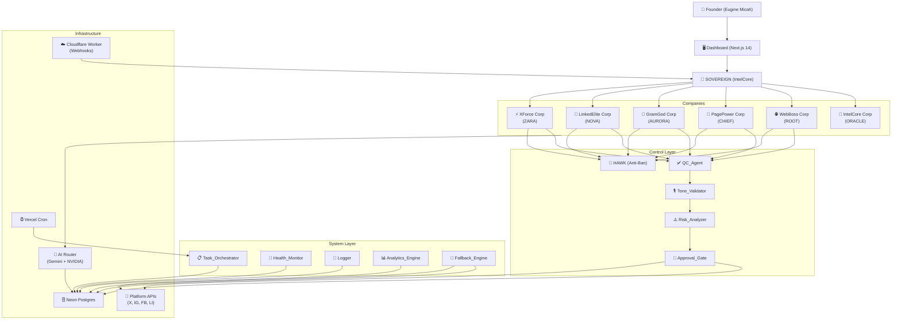
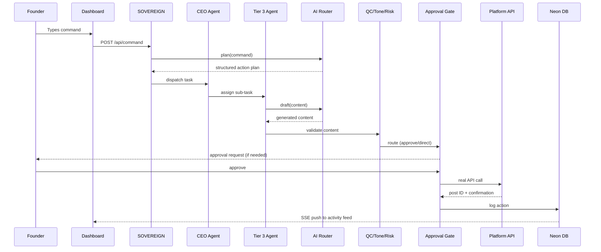
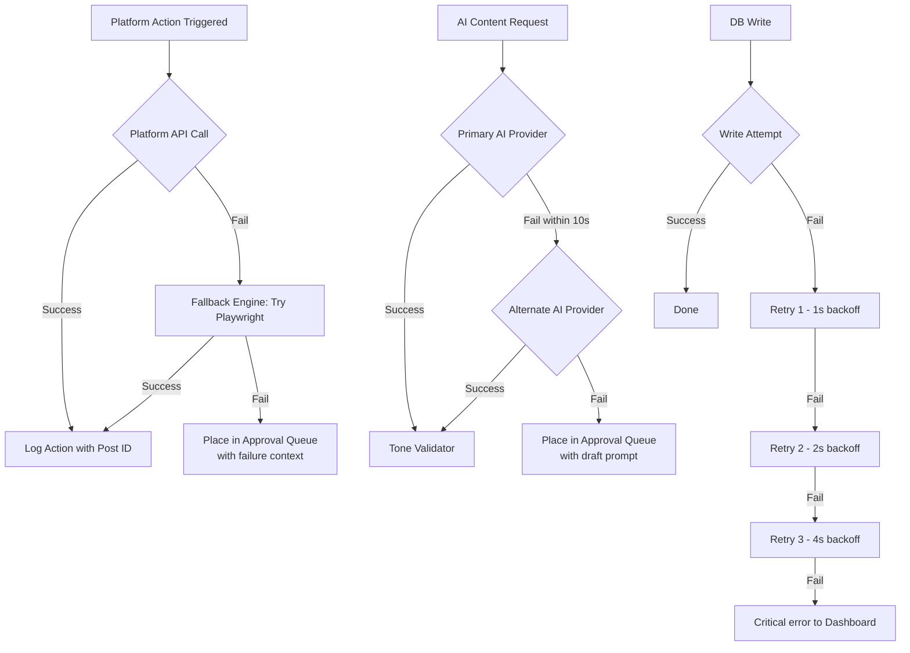
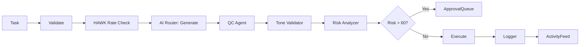

# ProPost Rebuild — Design Document

## Overview

ProPost is a social media operating system built exclusively for Eugine Micah. It is not a scheduler — it is a living, multi-agent command center structured as six companies, each owning a platform or intelligence domain, all reporting to the Founder through a supreme orchestrator agent (SOVEREIGN).

This rebuild replaces a broken prior implementation where all API calls were mocked, agents returned hardcoded strings, the activity feed was randomly generated, the Gemini API was non-functional, platform credentials were missing or unwired, the database was empty, webhooks were never verified, and Vercel cron jobs had stopped.

The rebuild delivers:
- Real platform posting via native APIs (X v2, Instagram Graph, Facebook Graph, LinkedIn)
- Real AI content generation via Gemini 2.0 Flash and NVIDIA NIM (llama-3.1-70b)
- A 35-agent hierarchy across 5 tiers with real task routing and orchestration
- A Neon Postgres database with full persistence of every action, task, and memory entry
- A Next.js 14 App Router dashboard with Canvas 2D virtual office, SSE live feeds, and approval queue
- Cloudflare Worker webhook handling with HMAC signature verification
- Anti-ban compliance engine (HAWK) with rate limiting, randomized delays, and human-like behavior

---

## Architecture

### System Topology



### Request Flow — Founder Command



### Fallback Chain



---

## Components and Interfaces

### Agent Engine (`lib/agents/`)

Each agent is a TypeScript class implementing the `Agent` interface:

```typescript
interface Agent {
  name: string
  tier: 1 | 2 | 3 | 4 | 5
  company: Company
  status: AgentStatus
  
  execute(task: Task): Promise<TaskResult>
  receiveMessage(message: FounderMessage): Promise<AgentResponse>
  heartbeat(): Promise<void>
}

type AgentStatus = 'idle' | 'active' | 'paused' | 'error' | 'unresponsive'
type Company = 'xforce' | 'linkedelite' | 'gramgod' | 'pagepower' | 'webboss' | 'intelcore' | 'system'
```

Agent execution pipeline:



### AI Router (`lib/ai/`)

```typescript
type AITask = 'plan' | 'draft' | 'analyze' | 'summarize' | 'generate' | 'validate'

interface AIRouter {
  route(task: AITask, prompt: string, context?: object): Promise<AIResponse>
}

// Routing logic:
// plan | analyze | summarize | validate → Gemini 2.0 Flash (reasoning)
// draft | generate → NVIDIA NIM llama-3.1-70b (creative)
// On primary failure (10s timeout) → switch to alternate
// On both failure → throw AIProviderError → Fallback Engine
```

Provider configuration:

```typescript
interface GeminiConfig {
  model: 'gemini-2.0-flash'
  apiKey: process.env.GEMINI_API_KEY
  timeout: 10000
}

interface NVIDIAConfig {
  model: 'meta/llama-3.1-70b-instruct'
  baseUrl: 'https://integrate.api.nvidia.com/v1'
  apiKey: process.env.NVIDIA_API_KEY
  timeout: 10000
}
```

### Platform Adapters (`lib/platforms/`)

Each adapter implements:

```typescript
interface PlatformAdapter {
  platform: Platform
  post(content: PostContent): Promise<PlatformPostResult>
  reply(targetId: string, content: string): Promise<PlatformPostResult>
  getMetrics(postId: string): Promise<PostMetrics>
  verifyCredentials(): Promise<boolean>
}

interface PlatformPostResult {
  success: boolean
  postId?: string          // real platform post ID — never null on success
  url?: string
  error?: string
  rawResponse?: unknown    // full platform API response stored
}
```

Platform-specific implementations:

| Adapter | API | Auth Method | Rate Limits |
|---|---|---|---|
| `XAdapter` | X API v2 | OAuth 2.0 Bearer + User Token | 20 posts/day |
| `InstagramAdapter` | Instagram Graph API | Page Access Token | 25 posts/day |
| `FacebookAdapter` | Facebook Graph API | Page Access Token | 10 posts/day, 30min gap |
| `LinkedInAdapter` | LinkedIn API v2 | OAuth 2.0 | 5 posts/day, 100 connections/day |
| `WebsiteAdapter` | Vercel Deploy API / CMS | API Token | N/A |

### Fallback Engine (`lib/fallback/`)

```typescript
interface FallbackEngine {
  handlePlatformFailure(task: Task, error: Error): Promise<FallbackResult>
  handleAIFailure(task: Task, error: Error): Promise<FallbackResult>
  handleDBFailure(write: DBWrite, error: Error): Promise<FallbackResult>
}

type FallbackResult =
  | { outcome: 'success'; method: 'playwright' | 'alternate_ai'; result: unknown }
  | { outcome: 'queued'; approvalId: string }
  | { outcome: 'critical'; logged: true }
```

Playwright automation runs in a sandboxed Chromium instance with human-like typing simulation (random keystroke delays 50–150ms, mouse movement curves).

### Task System (`lib/tasks/`)

```typescript
interface TaskOrchestrator {
  createTask(spec: TaskSpec): Promise<Task>
  assignTask(taskId: string, agentName: string): Promise<void>
  updateStatus(taskId: string, status: TaskStatus): Promise<void>
  getActiveTasks(): Promise<Task[]>
}

type TaskStatus = 'queued' | 'assigned' | 'active' | 'pending_approval' | 'completed' | 'failed' | 'cancelled'

interface TaskSpec {
  type: TaskType
  company: Company
  platform?: Platform
  contentPillar?: ContentPillar
  scheduledAt?: Date
  priority: 1 | 2 | 3   // 1 = highest
  parentTaskId?: string  // for sub-tasks
}
```

### Memory System (`lib/memory/`)

```typescript
interface MemorySystem {
  store(entry: MemoryEntry): Promise<void>
  retrieve(agentName: string, filters: MemoryFilters): Promise<MemoryEntry[]>
  search(query: string, agentName?: string): Promise<MemoryEntry[]>
  export(agentName: string, dateRange: DateRange): Promise<MemoryEntry[]>
}

interface MemoryFilters {
  agentName?: string
  platform?: Platform
  dateFrom?: Date
  dateTo?: Date
  keyword?: string
}
```

### Webhook Handler (`app/api/webhooks/`)

Cloudflare Worker compatible — no Node.js-only APIs:

```typescript
// Verification per platform:
// X: HMAC-SHA256 of raw body with consumer secret
// Instagram: SHA256 HMAC with app secret, header: x-hub-signature-256
// Facebook: SHA256 HMAC with app secret, header: x-hub-signature-256

async function verifyWebhook(
  platform: 'x' | 'instagram' | 'facebook',
  rawBody: string,
  signature: string
): Promise<boolean>
```

### HAWK Anti-Ban Engine

```typescript
interface HAWKEngine {
  checkRateLimit(platform: Platform): Promise<RateLimitStatus>
  recordAction(platform: Platform): Promise<void>
  getDelay(platform: Platform): Promise<number>  // 30s–300s random
  enforceMinGap(platform: Platform): Promise<void>  // 2min minimum
  haltPlatform(platform: Platform, durationMs: number): Promise<void>
}

interface RateLimitStatus {
  allowed: boolean
  currentCount: number
  limit: number
  resetAt: Date
  haltedUntil?: Date
}

// Per-platform daily limits:
const DAILY_LIMITS: Record<Platform, number> = {
  x: 20,
  instagram: 25,
  linkedin: 5,
  facebook: 10,
}

// Per-platform hourly safe thresholds:
const HOURLY_SAFE: Record<Platform, number> = {
  x: 5,
  instagram: 4,
  linkedin: 2,
  facebook: 3,
}
```

### SSE / Real-Time Layer

Activity feed and agent status use Server-Sent Events:

```typescript
// GET /api/activity — SSE stream
// GET /api/agents/status — SSE stream

interface ActivityEvent {
  id: string
  type: 'post' | 'reply' | 'dm' | 'task_complete' | 'alert' | 'approval'
  agentName: string
  company: Company
  platform?: Platform
  contentPreview?: string
  timestamp: string
  postId?: string
}
```

### Virtual Office (Canvas 2D)

```typescript
interface VirtualOffice {
  rooms: Record<Company, Room>
  agents: Record<string, AgentSprite>
  
  render(ctx: CanvasRenderingContext2D): void
  updateAgentState(agentName: string, state: SpriteState): void
  highlightRoom(company: Company, durationMs: number): void
  onAgentClick(agentName: string, callback: (agent: AgentSprite) => void): void
}

type SpriteState = 'idle' | 'working' | 'walking' | 'alert'

interface Room {
  company: Company
  label: string
  position: { x: number; y: number; w: number; h: number }
  color: string
}

// Room layout (6-grid, 2 rows × 3 cols):
// [War Room][Studio][Boardroom]
// [Community Hall][Engine Room][Situation Room]
```

Sprite animation frames: 16×16 px sprites, 4 frames per state, 150ms per frame. States driven by agent status from SSE stream.

---

## Data Models

### Database Schema (Neon Postgres)

```sql
-- Agents
CREATE TABLE agents (
  id          UUID PRIMARY KEY DEFAULT gen_random_uuid(),
  name        TEXT NOT NULL UNIQUE,
  tier        SMALLINT NOT NULL CHECK (tier BETWEEN 1 AND 5),
  company     TEXT NOT NULL,
  status      TEXT NOT NULL DEFAULT 'idle',
  config      JSONB DEFAULT '{}',
  last_heartbeat TIMESTAMPTZ,
  created_at  TIMESTAMPTZ DEFAULT NOW()
);

-- Companies
CREATE TABLE companies (
  id          UUID PRIMARY KEY DEFAULT gen_random_uuid(),
  name        TEXT NOT NULL UNIQUE,  -- 'xforce', 'linkedelite', etc.
  display_name TEXT NOT NULL,
  ceo_agent   TEXT NOT NULL,
  platform    TEXT,                  -- null for intelcore
  active      BOOLEAN DEFAULT TRUE,
  created_at  TIMESTAMPTZ DEFAULT NOW()
);

-- Tasks
CREATE TABLE tasks (
  id              UUID PRIMARY KEY DEFAULT gen_random_uuid(),
  type            TEXT NOT NULL,
  company         TEXT NOT NULL,
  platform        TEXT,
  assigned_agent  TEXT,
  parent_task_id  UUID REFERENCES tasks(id),
  status          TEXT NOT NULL DEFAULT 'queued',
  priority        SMALLINT DEFAULT 2,
  content_pillar  TEXT,
  scheduled_at    TIMESTAMPTZ,
  started_at      TIMESTAMPTZ,
  completed_at    TIMESTAMPTZ,
  result          JSONB,
  error           TEXT,
  created_at      TIMESTAMPTZ DEFAULT NOW()
);

-- Actions (every real executed operation)
CREATE TABLE actions (
  id              UUID PRIMARY KEY DEFAULT gen_random_uuid(),
  task_id         UUID REFERENCES tasks(id),
  agent_name      TEXT NOT NULL,
  company         TEXT NOT NULL,
  platform        TEXT NOT NULL,
  action_type     TEXT NOT NULL,   -- 'post', 'reply', 'dm', 'publish', etc.
  content         TEXT,
  status          TEXT NOT NULL,   -- 'success', 'failed', 'pending'
  platform_post_id TEXT,           -- real platform ID — required on success
  platform_response JSONB,         -- full raw response stored
  timestamp       TIMESTAMPTZ DEFAULT NOW()
);

-- Content Queue
CREATE TABLE content_queue (
  id              UUID PRIMARY KEY DEFAULT gen_random_uuid(),
  platform        TEXT NOT NULL,
  content_pillar  TEXT NOT NULL,
  content         TEXT NOT NULL,
  media_urls      TEXT[],
  status          TEXT DEFAULT 'draft',  -- 'draft', 'scheduled', 'published', 'cancelled'
  scheduled_at    TIMESTAMPTZ,
  published_at    TIMESTAMPTZ,
  action_id       UUID REFERENCES actions(id),
  created_by      TEXT NOT NULL,         -- agent name
  created_at      TIMESTAMPTZ DEFAULT NOW()
);

-- Memory Entries
CREATE TABLE memory_entries (
  id              UUID PRIMARY KEY DEFAULT gen_random_uuid(),
  agent_name      TEXT NOT NULL,
  context_summary TEXT NOT NULL,
  related_action_ids UUID[],
  platform        TEXT,
  tags            TEXT[],
  created_at      TIMESTAMPTZ DEFAULT NOW()
);

-- Platform Connections (no raw credential values)
CREATE TABLE platform_connections (
  id              UUID PRIMARY KEY DEFAULT gen_random_uuid(),
  platform        TEXT NOT NULL UNIQUE,
  status          TEXT NOT NULL DEFAULT 'disconnected',  -- 'connected', 'disconnected', 'expired', 'error'
  last_verified   TIMESTAMPTZ,
  expires_at      TIMESTAMPTZ,
  scopes          TEXT[],
  error_message   TEXT,
  updated_at      TIMESTAMPTZ DEFAULT NOW()
);

-- Analytics Snapshots
CREATE TABLE analytics_snapshots (
  id              UUID PRIMARY KEY DEFAULT gen_random_uuid(),
  platform        TEXT NOT NULL,
  metric_type     TEXT NOT NULL,   -- 'impressions', 'likes', 'followers', etc.
  value           BIGINT NOT NULL,
  post_id         TEXT,            -- null for account-level metrics
  snapshot_date   DATE NOT NULL,
  created_at      TIMESTAMPTZ DEFAULT NOW()
);

-- Approval Queue
CREATE TABLE approval_queue (
  id              UUID PRIMARY KEY DEFAULT gen_random_uuid(),
  task_id         UUID REFERENCES tasks(id),
  action_type     TEXT NOT NULL,
  platform        TEXT,
  agent_name      TEXT NOT NULL,
  content         TEXT,
  content_preview TEXT,
  risk_level      TEXT NOT NULL DEFAULT 'medium',  -- 'low', 'medium', 'high', 'critical'
  risk_score      SMALLINT,
  failure_context JSONB,
  status          TEXT DEFAULT 'pending',  -- 'pending', 'approved', 'rejected', 'edited'
  founder_note    TEXT,
  edited_content  TEXT,
  created_at      TIMESTAMPTZ DEFAULT NOW(),
  resolved_at     TIMESTAMPTZ
);

-- Fallback Log
CREATE TABLE fallback_log (
  id              UUID PRIMARY KEY DEFAULT gen_random_uuid(),
  task_id         UUID REFERENCES tasks(id),
  agent_name      TEXT NOT NULL,
  platform        TEXT,
  error_type      TEXT NOT NULL,
  error_message   TEXT NOT NULL,
  fallback_steps  JSONB NOT NULL,  -- array of attempted steps with outcomes
  final_outcome   TEXT NOT NULL,   -- 'success', 'queued', 'critical'
  created_at      TIMESTAMPTZ DEFAULT NOW()
);

-- Conversations (Founder ↔ Agent)
CREATE TABLE conversations (
  id              UUID PRIMARY KEY DEFAULT gen_random_uuid(),
  agent_name      TEXT NOT NULL,
  role            TEXT NOT NULL,   -- 'founder' | 'agent'
  content         TEXT NOT NULL,
  created_at      TIMESTAMPTZ DEFAULT NOW()
);

-- Content Pillars
CREATE TABLE content_pillars (
  id              UUID PRIMARY KEY DEFAULT gen_random_uuid(),
  name            TEXT NOT NULL UNIQUE,
  slug            TEXT NOT NULL UNIQUE,
  schedule_config JSONB NOT NULL,  -- cron expressions, frequency, platforms
  active          BOOLEAN DEFAULT TRUE,
  created_at      TIMESTAMPTZ DEFAULT NOW()
);
```

### TypeScript Types

```typescript
// Core domain types
type Platform = 'x' | 'instagram' | 'facebook' | 'linkedin' | 'website'
type ContentPillar =
  | 'ai_news'
  | 'youth_empowerment'
  | 'trending_topics'
  | 'elite_conversations'
  | 'kenyan_entertainment'
  | 'fashion'
  | 'media_journalism'
  | 'personal_story'
  | 'entrepreneurship'
  | 'culture_identity'

type TaskType =
  | 'post_content'
  | 'reply'
  | 'dm_response'
  | 'thread_publish'
  | 'reel_publish'
  | 'story_publish'
  | 'article_publish'
  | 'blog_publish'
  | 'analytics_pull'
  | 'trend_analysis'
  | 'seo_audit'
  | 'health_check'
  | 'memory_store'
  | 'report_generate'
```

### Content Pillar Schedule Configuration

```typescript
const PILLAR_SCHEDULES: Record<ContentPillar, PillarSchedule> = {
  ai_news: {
    cron: ['0 3 * * *', '0 9 * * *', '0 15 * * *', '0 21 * * *'], // 06:00, 12:00, 18:00, 00:00 EAT (UTC+3)
    platforms: ['x', 'instagram', 'facebook', 'linkedin'],
    frequency: 4,
  },
  youth_empowerment: {
    cron: ['0 7 * * 1'],  // Monday 10:00 EAT
    platforms: ['x', 'instagram', 'linkedin'],
    frequency: 1,
  },
  trending_topics: {
    cron: ['0 6 * * *', '0 14 * * *'],  // 2x daily reactive
    platforms: ['x', 'instagram', 'facebook'],
    frequency: 2,
  },
  // ... remaining pillars
}
```

---

## API Contracts

### Dashboard API Routes

```
POST /api/command
  Body: { message: string }
  Response: { taskId: string; plan: string; dispatchedTo: string[] }

GET /api/agents/status          (SSE stream)
  Event: AgentStatusEvent[]

POST /api/agents/[name]/message
  Body: { content: string }
  Response: { response: string; conversationId: string }

GET /api/activity               (SSE stream)
  Event: ActivityEvent

POST /api/approve/[id]
  Body: { editedContent?: string }
  Response: { released: boolean; taskId: string }

POST /api/reject/[id]
  Body: { reason: string }
  Response: { cancelled: boolean }

GET /api/tasks
  Query: { company?, agent?, status?, platform? }
  Response: Task[]

GET /api/content/calendar
  Query: { from: string; to: string }
  Response: ContentQueueItem[]

GET /api/analytics/summary
  Query: { platform?, period: '7d' | '30d' | '90d' }
  Response: AnalyticsSummary

GET /api/memory
  Query: { agent?, platform?, keyword?, from?, to? }
  Response: MemoryEntry[]

GET /api/connections
  Response: PlatformConnection[]
```

### Cron Routes (Vercel Cron / Cloudflare Scheduled)

```
POST /api/cron/ai-news          (every 6h: 03:00, 09:00, 15:00, 21:00 UTC)
POST /api/cron/analytics        (daily 02:00 UTC)
POST /api/cron/health           (every 5min)
POST /api/cron/content-schedule (every 15min — checks content_queue for due items)
```

### Webhook Routes

```
POST /api/webhooks/x
  Headers: x-twitter-webhooks-signature
  Body: X webhook payload

POST /api/webhooks/instagram
  Headers: x-hub-signature-256
  Body: Instagram webhook payload

POST /api/webhooks/facebook
  Headers: x-hub-signature-256
  Body: Facebook webhook payload
```

---

## Error Handling

### Error Taxonomy

```typescript
class PlatformAPIError extends Error {
  constructor(
    public platform: Platform,
    public statusCode: number,
    public rateLimited: boolean,
    message: string
  ) { super(message) }
}

class AIProviderError extends Error {
  constructor(
    public provider: 'gemini' | 'nvidia',
    public timedOut: boolean,
    message: string
  ) { super(message) }
}

class WebhookVerificationError extends Error {
  constructor(
    public platform: Platform,
    public sourceIp: string,
    message: string
  ) { super(message) }
}

class CredentialMissingError extends Error {
  constructor(
    public envVar: string,
    public platform: Platform,
    message: string
  ) { super(message) }
}
```

### Error Handling Rules

1. Platform API errors with `rateLimited: true` → HAWK halts platform for rate limit reset window
2. Platform API errors with `statusCode: 401` → alert Founder, halt platform tasks, update `platform_connections`
3. `AIProviderError` → Fallback Engine switches provider; if both fail → Approval Queue
4. `WebhookVerificationError` → 403 response, log with source IP, never process payload
5. `CredentialMissingError` at startup → log startup error, disable affected platform, continue for other platforms
6. DB write failures → retry 3× with exponential backoff (1s, 2s, 4s); on final failure → critical Dashboard alert
7. Every unhandled error in an agent → Logger records it, Health_Monitor marks agent as `error`, SOVEREIGN notified

### Startup Credential Validation

```typescript
// lib/startup.ts — runs at app initialization
const REQUIRED_ENV: Record<Platform, string[]> = {
  x: ['X_API_KEY', 'X_API_SECRET', 'X_ACCESS_TOKEN', 'X_ACCESS_SECRET'],
  instagram: ['INSTAGRAM_ACCESS_TOKEN', 'INSTAGRAM_BUSINESS_ACCOUNT_ID'],
  facebook: ['FACEBOOK_PAGE_ACCESS_TOKEN', 'FACEBOOK_PAGE_ID'],
  linkedin: ['LINKEDIN_ACCESS_TOKEN', 'LINKEDIN_PERSON_URN'],
  website: ['VERCEL_DEPLOY_HOOK_URL'],
}
const AI_ENV = ['GEMINI_API_KEY', 'NVIDIA_API_KEY']
const DB_ENV = ['DATABASE_URL']
```

---

## Correctness Properties

*A property is a characteristic or behavior that should hold true across all valid executions of a system — essentially, a formal statement about what the system should do. Properties serve as the bridge between human-readable specifications and machine-verifiable correctness guarantees.*


### Property 1: No Mock Success — Real Post ID Required

*For any* platform action marked as `success`, the `platform_post_id` field in the `actions` table must be a non-null, non-empty string returned by the real platform API — never a hardcoded value, UUID generated locally, or placeholder.

**Validates: Requirements 1.1, 1.2, 1.5**

---

### Property 2: Platform Fallback Completeness

*For any* platform action where the Platform API call fails, the `fallback_log` table must contain an entry for that task showing a Browser_Automation attempt before the task is placed in the Approval Queue or marked failed. No platform failure may skip directly to `failed` status without a logged fallback attempt.

**Validates: Requirements 1.3, 1.4, 13.1**

---

### Property 3: AI Router Task-Type Routing

*For any* AI task of type `plan`, `analyze`, `summarize`, or `validate`, the AI Router must select Gemini as the primary provider. *For any* task of type `draft` or `generate`, the AI Router must select NVIDIA NIM as the primary provider. The provider selection must be deterministic given the task type.

**Validates: Requirements 2.1**

---

### Property 4: AI Fallback Completeness

*For any* AI content request where the primary provider fails or times out, the alternate provider must be attempted before the task is placed in the Approval Queue. The `fallback_log` must record both the primary failure and the alternate attempt. If both fail, an `approval_queue` entry must exist with the original prompt.

**Validates: Requirements 2.2, 2.3**

---

### Property 5: Content Pipeline Ordering

*For any* generated content item, the execution log must show Tone_Validator invocation occurring before QC_Agent invocation. Content must never reach QC_Agent without first passing through Tone_Validator.

**Validates: Requirements 2.5**

---

### Property 6: Tone Rejection Retry Limit

*For any* content item rejected by Tone_Validator, the AI Router must attempt regeneration at most 2 additional times (3 total attempts) before escalating to the Approval Queue. The retry count in the task record must never exceed 2 for tone-rejection retries.

**Validates: Requirements 2.6**

---

### Property 7: CEO Task Decomposition

*For any* task assigned to a CEO Agent, the `tasks` table must contain at least one sub-task with `parent_task_id` referencing the CEO task and `assigned_agent` set to a Tier 2 or Tier 3 agent belonging to that CEO's company.

**Validates: Requirements 3.3**

---

### Property 8: Task Status Propagation

*For any* parent task, when all of its sub-tasks have status `completed`, the parent task's status must also be updated to `completed`. No parent task may remain in `active` status when all its children are `completed`.

**Validates: Requirements 3.4, 3.5**

---

### Property 9: Agent Active Status Invariant

*For any* agent that has a task with status `active` assigned to it, the agent's `status` field in the `agents` table must be `active`. An agent must not be marked `idle` while it has an active task.

**Validates: Requirements 3.7**

---

### Property 10: Risk Gate Enforcement

*For any* proposed action with `risk_score > 60`, an `approval_queue` entry must exist and have status `pending` before the action is executed. No action with `risk_score > 60` may have a corresponding `actions` entry with status `success` without a prior `approval_queue` entry with status `approved`.

**Validates: Requirements 9.4, 12.6**

---

### Property 11: Memory Persistence Round-Trip

*For any* memory entry written to the `memory_entries` table, it must be retrievable by querying with the agent name and the creation date. Memory entries must not be deleted or become unretrievable within 90 days of creation.

**Validates: Requirements 9.3, 9.5**

---

### Property 12: Content Pillar Tagging Invariant

*For any* content item in the `content_queue` table, the `content_pillar` field must be exactly one of the 10 defined pillar slugs. No content item may have a null, empty, or unrecognized pillar value.

**Validates: Requirements 10.1, 10.2**

---

### Property 13: Platform Formatting Constraints

*For any* content item destined for X, the content length must be ≤ 280 characters. *For any* content item destined for Instagram, the content must include a hashtag block. *For any* content item destined for LinkedIn, the content must be in professional long-form format (≥ 150 characters). These constraints must hold for all content in the `content_queue` before publishing.

**Validates: Requirements 10.5**

---

### Property 14: Anti-Ban Delay Bounds

*For any* platform action, the actual execution timestamp must be between 30 seconds and 300 seconds (5 minutes) after the scheduled trigger time. No action may execute at exactly the scheduled time (delay = 0) or more than 5 minutes late due to artificial delay.

**Validates: Requirements 11.1**

---

### Property 15: Consecutive Action Gap

*For any* two consecutive actions on the same platform by any agent, the time difference between their `timestamp` values in the `actions` table must be ≥ 120 seconds (2 minutes). No platform may have two action records with timestamps less than 2 minutes apart.

**Validates: Requirements 11.2**

---

### Property 16: Rate Limit Enforcement

*For any* platform, when the count of actions in the `actions` table for that platform within the current hour reaches or exceeds the platform's hourly safe threshold, all subsequent action attempts for that platform must be rejected by HAWK and no new `actions` records with status `success` may be created for that platform until the rate limit window resets.

**Validates: Requirements 11.3, 11.4**

---

### Property 17: Approval Queue Field Completeness

*For any* item in the `approval_queue` table, the following fields must all be non-null: `action_type`, `agent_name`, `risk_level`, `status`, `created_at`. Items requiring content preview must also have a non-null `content_preview`.

**Validates: Requirements 12.1**

---

### Property 18: Approval Gate State Transitions

*For any* approval queue item, approving it must result in the associated task transitioning to `active` status and the queue item transitioning to `approved`. Rejecting it must result in the associated task transitioning to `cancelled` and the queue item transitioning to `rejected`. No other state transitions are valid from `pending`.

**Validates: Requirements 12.2, 12.3**

---

### Property 19: Database Write Retry on Failure

*For any* database write that fails, the system must attempt exactly 3 retries with exponential backoff (1s, 2s, 4s delays) before logging a critical error. The `fallback_log` must record each retry attempt. The system must never attempt more than 3 retries for a single write operation.

**Validates: Requirements 13.5**

---

### Property 20: No Silent Failures

*For any* task that reaches a terminal `failed` state, a corresponding entry must exist in the `fallback_log` table with `error_type`, `error_message`, `fallback_steps`, and `final_outcome` all populated. No task may be marked `failed` without a fallback log entry.

**Validates: Requirements 13.6**

---

### Property 21: Action Persistence Completeness

*For any* executed action, the `actions` table record must contain all of: `agent_name`, `company`, `platform`, `action_type`, `status`, `timestamp`. For successful actions, `platform_post_id` and `platform_response` must also be non-null.

**Validates: Requirements 17.1**

---

### Property 22: DB Write Queue on Disconnect

*For any* database write attempted while the Neon DB connection is unavailable, the write must be held in the in-memory queue and successfully flushed to the database within 60 seconds of connection restoration. No queued write may be silently dropped.

**Validates: Requirements 17.4**

---

### Property 23: Webhook Signature Verification

*For any* incoming webhook request with an invalid or missing signature, the system must return HTTP 403 and must not process the payload or create any task or action records. *For any* webhook request with a valid signature, the system must process the payload and route it to the appropriate agent.

**Validates: Requirements 19.1, 19.2**

---

### Property 24: Analytics Persistence Round-Trip

*For any* analytics pull from a platform API, the resulting metrics must be stored in the `analytics_snapshots` table with `platform`, `metric_type`, `value`, and `snapshot_date` all populated. The stored values must be retrievable by platform and date.

**Validates: Requirements 20.1**

---

### Property 25: Agent Unresponsive Detection

*For any* agent whose last heartbeat timestamp is more than 10 minutes in the past and who has no task completion recorded in that window, the agent's `status` in the `agents` table must be `unresponsive`. The Health_Monitor must update this status without requiring a manual trigger.

**Validates: Requirements 22.3**

---

## Error Handling

### Error Taxonomy

```typescript
class PlatformAPIError extends Error {
  constructor(
    public platform: Platform,
    public statusCode: number,
    public rateLimited: boolean,
    message: string
  ) { super(message) }
}

class AIProviderError extends Error {
  constructor(
    public provider: 'gemini' | 'nvidia',
    public timedOut: boolean,
    message: string
  ) { super(message) }
}

class WebhookVerificationError extends Error {
  constructor(
    public platform: Platform,
    public sourceIp: string,
    message: string
  ) { super(message) }
}

class CredentialMissingError extends Error {
  constructor(
    public envVar: string,
    public platform: Platform,
    message: string
  ) { super(message) }
}

class RateLimitError extends Error {
  constructor(
    public platform: Platform,
    public resetAt: Date,
    message: string
  ) { super(message) }
}
```

### Error Handling Decision Table

| Error Type | Condition | Action |
|---|---|---|
| `PlatformAPIError` | `rateLimited: true` | HAWK halts platform; schedule resume at reset window |
| `PlatformAPIError` | `statusCode: 401/403` | Alert Founder; halt platform tasks; update `platform_connections` |
| `PlatformAPIError` | `statusCode: 5xx` | Fallback Engine → Playwright |
| `AIProviderError` | Primary timeout | Switch to alternate provider |
| `AIProviderError` | Both providers fail | Place in Approval Queue with prompt |
| `WebhookVerificationError` | Any | Return 403; log with source IP; discard payload |
| `CredentialMissingError` | Startup | Log startup error; disable platform; continue others |
| DB write failure | Any | Retry 3× (1s, 2s, 4s); on final fail → critical Dashboard alert |
| Agent unhandled error | Any | Logger records; Health_Monitor marks `error`; SOVEREIGN notified |
| Tone rejection | ≤ 2 retries | Regenerate with corrected prompt |
| Tone rejection | 3rd attempt | Escalate to Approval Queue |

### Startup Credential Validation

```typescript
// lib/startup.ts — runs at app initialization
const REQUIRED_ENV: Record<Platform, string[]> = {
  x: ['X_API_KEY', 'X_API_SECRET', 'X_ACCESS_TOKEN', 'X_ACCESS_SECRET'],
  instagram: ['INSTAGRAM_ACCESS_TOKEN', 'INSTAGRAM_BUSINESS_ACCOUNT_ID'],
  facebook: ['FACEBOOK_PAGE_ACCESS_TOKEN', 'FACEBOOK_PAGE_ID'],
  linkedin: ['LINKEDIN_ACCESS_TOKEN', 'LINKEDIN_PERSON_URN'],
  website: ['VERCEL_DEPLOY_HOOK_URL'],
}
const AI_ENV = ['GEMINI_API_KEY', 'NVIDIA_API_KEY']
const DB_ENV = ['DATABASE_URL']

export async function validateStartup(): Promise<StartupReport> {
  const missing: string[] = []
  const disabled: Platform[] = []
  
  for (const [platform, vars] of Object.entries(REQUIRED_ENV)) {
    for (const v of vars) {
      if (!process.env[v]) {
        missing.push(v)
        disabled.push(platform as Platform)
      }
    }
  }
  
  return { missing, disabled, healthy: missing.length === 0 }
}
```

---

## Testing Strategy

### Dual Testing Approach

ProPost uses both unit tests and property-based tests. They are complementary:

- Unit tests catch specific bugs, verify concrete examples, and test error conditions
- Property-based tests verify universal correctness across all valid inputs

### Property-Based Testing

**Library**: `fast-check` (TypeScript/JavaScript)

Each correctness property from this document maps to exactly one property-based test. Tests run a minimum of 100 iterations per property.

Tag format for each test:
```
// Feature: propost-rebuild, Property N: <property_text>
```

Example property test structure:

```typescript
import fc from 'fast-check'
import { test, expect } from 'vitest'

// Feature: propost-rebuild, Property 1: No Mock Success — Real Post ID Required
test('successful actions always have a real platform_post_id', () => {
  fc.assert(
    fc.property(
      fc.record({
        agentName: fc.string({ minLength: 1 }),
        platform: fc.constantFrom('x', 'instagram', 'facebook', 'linkedin'),
        content: fc.string({ minLength: 1, maxLength: 280 }),
      }),
      async (actionSpec) => {
        const result = await executePostAction(actionSpec)
        if (result.status === 'success') {
          expect(result.platform_post_id).toBeTruthy()
          expect(result.platform_post_id).not.toMatch(/^mock-|^fake-|^test-/)
        }
      }
    ),
    { numRuns: 100 }
  )
})
```

**Property test coverage** (one test per property):

| Property | Test Description | Generator Strategy |
|---|---|---|
| P1 | Successful actions have real post IDs | Random action specs against real adapter |
| P2 | Platform failures trigger fallback log | Simulate API failures, check fallback_log |
| P3 | AI router selects correct provider by task type | Random task types, verify provider selection |
| P4 | AI failures trigger alternate then queue | Simulate provider failures, check fallback chain |
| P5 | Tone validation precedes QC in pipeline | Random content, verify execution order in log |
| P6 | Tone rejection retries ≤ 2 | Simulate tone rejections, count retry attempts |
| P7 | CEO tasks produce sub-tasks | Random task specs for CEO agents, check DB |
| P8 | All sub-tasks complete → parent complete | Random task trees, complete all children, check parent |
| P9 | Active task → agent status = active | Random agent/task pairs, verify status invariant |
| P10 | risk_score > 60 → approval queue before execution | Random risk scores, verify gate enforcement |
| P11 | Memory entries retrievable by agent+date | Random memory entries, round-trip retrieve |
| P12 | Content always has exactly one pillar | Random content generation, check pillar field |
| P13 | Platform formatting constraints hold | Random content per platform, check format rules |
| P14 | Post delay within 30s–300s bounds | Random scheduled times, verify actual execution time |
| P15 | Consecutive same-platform actions ≥ 2min apart | Random action sequences, check timestamps |
| P16 | Rate limit exceeded → no new successes | Simulate rate limit breach, verify HAWK blocks |
| P17 | Approval queue items have required fields | Random queue items, verify field completeness |
| P18 | Approve/reject produce correct state transitions | Random queue items, apply decisions, verify states |
| P19 | DB write failures retry exactly 3 times | Simulate DB failures, count retry attempts |
| P20 | Failed tasks always have fallback_log entry | Random task failures, verify log entry exists |
| P21 | Actions persisted with all required fields | Random actions, verify DB record completeness |
| P22 | DB disconnect queues writes, flushes on reconnect | Simulate disconnect, write, reconnect, verify flush |
| P23 | Invalid webhook signature → 403, no processing | Random payloads with invalid sigs, verify 403 |
| P24 | Analytics pulls stored in DB | Random metric pulls, round-trip retrieve |
| P25 | No heartbeat 10min → unresponsive status | Simulate time passing, verify status update |

### Unit Testing

Unit tests focus on:
- Specific examples that demonstrate correct behavior (e.g., X post with exactly 280 chars is valid, 281 is rejected)
- Integration points between components (e.g., SOVEREIGN → CEO dispatch)
- Edge cases and error conditions (e.g., empty content, null platform credentials)
- Webhook signature verification with known test vectors from each platform

**Framework**: Vitest

Run tests with:
```bash
vitest --run
```

### Integration Testing

Integration tests cover:
- Full posting pipeline end-to-end with real API sandbox credentials
- Cron trigger → task creation → agent execution → DB persistence
- SSE stream delivery of activity events to Dashboard
- Webhook receipt → agent routing → response generation

### Test File Structure

```
lib/
  agents/__tests__/
    sovereign.test.ts
    ceo-agents.test.ts
    tier3-agents.test.ts
  ai/__tests__/
    router.test.ts
    router.property.test.ts      ← P3, P4
  platforms/__tests__/
    adapters.test.ts
    adapters.property.test.ts    ← P1, P2
  fallback/__tests__/
    fallback.property.test.ts    ← P2, P19, P20
  tasks/__tests__/
    orchestrator.property.test.ts ← P7, P8, P9
  memory/__tests__/
    memory.property.test.ts      ← P11
  hawk/__tests__/
    hawk.property.test.ts        ← P14, P15, P16
  approval/__tests__/
    gate.property.test.ts        ← P10, P17, P18
  content/__tests__/
    pillar.property.test.ts      ← P12, P13
  db/__tests__/
    persistence.property.test.ts ← P21, P22
  webhooks/__tests__/
    verification.property.test.ts ← P23
  analytics/__tests__/
    analytics.property.test.ts   ← P24
  health/__tests__/
    monitor.property.test.ts     ← P25
```

---

## Implementation Phases

### Phase 1 — Foundation (Week 1–2)
1. Neon DB schema creation and migrations (`lib/db/schema.ts`, `lib/db/migrate.ts`)
2. Startup credential validation (`lib/startup.ts`)
3. AI Router with Gemini + NVIDIA integration (`lib/ai/router.ts`)
4. Base Agent class and Task Orchestrator (`lib/agents/base.ts`, `lib/tasks/orchestrator.ts`)
5. Logger and Memory System (`lib/logger.ts`, `lib/memory/store.ts`)

### Phase 2 — Platform Adapters (Week 2–3)
1. X Adapter (X API v2, OAuth 2.0)
2. Instagram Adapter (Graph API)
3. Facebook Adapter (Graph API)
4. LinkedIn Adapter (API v2)
5. HAWK Anti-Ban Engine
6. Fallback Engine with Playwright

### Phase 3 — Agent Hierarchy (Week 3–4)
1. SOVEREIGN + CEO Agents (Tier 1)
2. Strategic Agents (Tier 2)
3. Operational Agents (Tier 3)
4. Control Agents: QC, Tone_Validator, Risk_Analyzer, Approval_Gate (Tier 4)
5. System Agents: Health_Monitor, Analytics_Engine (Tier 5)

### Phase 4 — API Routes + Webhooks (Week 4–5)
1. `/api/command` → SOVEREIGN
2. SSE streams: `/api/activity`, `/api/agents/status`
3. Approval routes: `/api/approve/[id]`, `/api/reject/[id]`
4. Webhook handlers with HMAC verification (Cloudflare Worker compatible)
5. Cron routes

### Phase 5 — Dashboard (Week 5–6)
1. Empire overview (`/`)
2. Agent monitor (`/monitor`)
3. Task board (`/tasks`)
4. Content calendar (`/content`)
5. Approval inbox (`/inbox`)
6. Analytics (`/analytics`)
7. Memory browser (`/memory`)
8. Settings / Connections (`/settings`)

### Phase 6 — Virtual Office (Week 6–7)
1. Canvas 2D room layout (6 rooms, 2×3 grid)
2. Pixel sprite system (16×16, 4 states, 4 frames each)
3. SSE-driven state updates
4. Agent click → side panel
5. Room highlight on new action

### Phase 7 — Content Pillar Automation (Week 7–8)
1. Content pillar seed data (10 pillars)
2. Cron schedule wiring (AI News 4×/day, others per schedule)
3. Platform-specific formatting enforcement
4. Content calendar UI integration
